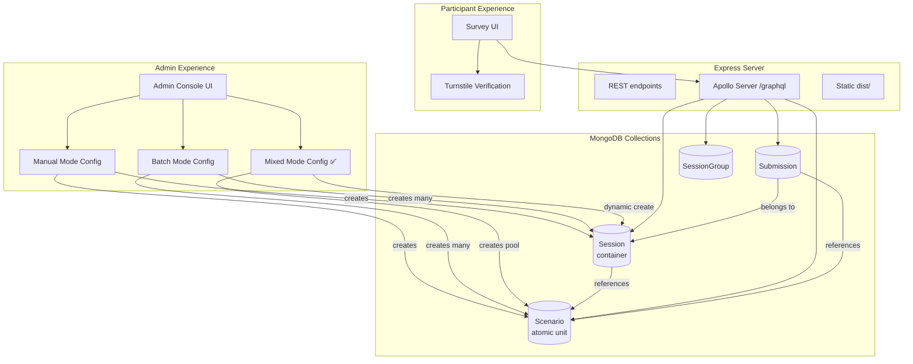

# System Design

This document describes how the PD Human-Agent Data Collect Demo is built using a **scenario-centric architecture**. Every section traces back to the requirements in [`requirements.md`](requirements.md).

**Implementation Status**: 🟢 **Phase 12-16 Complete** | 🟡 **Phase 17 Partial** (Heatmap deferred)

---

## Overview

A two-tier web application with a fundamentally refactored data model:

- **Frontend** — React 19 SPA built with Vite, routed by `react-router-dom@7`, styled by TailwindCSS (loaded from CDN) plus Material UI components. Communicates with backend exclusively over GraphQL with REST escape hatches for admin login and Turnstile.
- **Backend** — Node 20 Express 5 server hosting Apollo Server 5 (GraphQL), persisting through Mongoose to MongoDB.
- **Bot protection** — Cloudflare Turnstile with server-side `httpOnly` cookie.

**Architecture Innovation**: 
The system uses a **scenario-centric data model** where `Scenario` is the atomic unit and `Session` is a lightweight container. This unified design eliminates mode-specific code branches and enables flexible data collection strategies including Manual, Batch, and Mixed modes.

---

## Implementation Status Summary

| Phase | Status | Completion Date | Notes |
|-------|--------|-----------------|-------|
| Phase 1-11 | ✅ Complete | 2026-04-28 | Baseline features |
| Phase 12 | ✅ Complete | 2026-04-28 | Data models (Scenario, Session, etc.) |
| Phase 13 | ✅ Complete | 2026-04-28 | GraphQL API refactor |
| Phase 14 | ✅ Complete | 2026-04-28 | Utils layer |
| Phase 15 | ✅ Complete | 2026-04-29 | Admin UI (Manual, Batch, Mixed) |
| Phase 16 | ✅ Complete | 2026-04-29 | Survey flow (all modes) |
| Phase 17 | 🟡 Partial | Ongoing | Testing complete, heatmap deferred |
| Phase 30 | 📋 Planned | — | Submission invalidation (REQ-350..354) |
| Phase 31 | 📋 Planned | — | Complete submission data CSV export (REQ-360..363) |
| Phase 34 | 📋 Planned | — | Partner node peach-pink highlight (REQ-406) |
| Phase 35 | ✅ Complete | 2026-07-02 | Debrief screen with realised round, real opponent pairing, and persisted probabilistic payment (REQ-407, REQ-407.1) |

**Recent Updates**:
- 2026-04-29: Legacy API completely removed (~500 lines)
- 2026-04-29: Mixed Mode core functionality implemented
- 2026-05-04: NetworkGraph undefined bug fixed
- 2026-05-04: SurveyOutro completeSurvey bug fixed
- 2026-05-04: Scenario schema refined (scenarioIndex required, status simplified)
- 2026-05-04: Device fingerprinting design for participant identification (REQ-311)
- 2026-05-04: Mixed Mode config fields (`maxK`, `scenariosPerSession`, `targetSizePerScenario`) tightened to required (REQ-312) — see SessionGroup data model and Open Question #7
- 2026-05-04: Survey intro "關係結構" page now displays complete network history (REQ-405.1)
- 2026-05-04: **BUG FIXED** Admin history view read-only mode shows 0 active edges (BUG-003) — fixed by adding virtual activeEdgeIds field in toSessionGraph resolver
- 2026-05-05: URL-level mode differentiation design added — `SetupPanel.tsx` syncs `LaunchMode` toggle to `?mode=` query param via `useSearchParams` (REQ-204, REQ-205, REQ-206) — see Phase 26
- 2026-05-06: One-submission-per-participant enforcement (REQ-313) — three-layer fix: unique sparse index on `Submission`, `startSurvey` accepts `participantId` and returns existing submission on duplicate, client passes fingerprint ID — see Phase 27
- 2026-05-06: Submission progress tracking design added — `HistoryTable.tsx` enhanced submission detail view with progress bars and stage indicators (REQ-341, REQ-342) — see Phase 27
- 2026-05-06: **BUG FIXED** Mixed Mode session creation timing issue (BUG-004) — `startMixedSession` now deferred until after intro completion to match Manual Mode behavior and prevent duplicate sessions from React StrictMode — see Phase 28
- 2026-05-06: Submission invalidation feature designed (REQ-350..REQ-354) — new `isInvalid` field on `Submission`, `invalidateSubmission` mutation, cascading `submissionCount` and `Scenario.responseCount` corrections, admin UI filter — see Phase 30
- 2026-05-06: Complete submission data CSV export designed (REQ-360..REQ-363) — client-side CSV generation with row-per-answer format including full scenario configurations, demographics, timestamps, and validity flags — see Phase 31
- 2026-07-02: Debrief give/no-give outcome changed from a 50%-threshold rule to a persisted Bernoulli draw on the cooperation probability itself (REQ-407.1) — `drawRealisedRound` now also draws and persists `Submission.myDecisions`/`Submission.opponentDecisions` so the debrief screen and realised cash payout are stable across page refreshes; per-row probability percentages and the 50%-only "randomly decided" tooltip were removed from the UI — see Phase 35

---

## Architecture Diagram



---

## Core Architectural Principle: Scenario-Centric Design

### The Unified Abstraction

```text
Scenario (atomic) → self-contained experiment condition
    ↓
Session (container) → participant experience (ordered list of scenario IDs)
    ↓
Submission → responses to a session's scenarios
```

**Key Insight**:
> All three launch modes (Manual, Batch, Mixed) are identical from the participant's perspective: they complete a Session. The difference is **how** that Session's scenarios are selected and composed, not **what** happens during completion.

### Three Modes, One Model

| Mode | Session Composition | Scenario Selection Logic | URLs Generated |
|------|---------------------|--------------------------|----------------|
| **Manual** | Admin manually selects edges → generates design matrix → creates scenarios → creates one session | Scenarios come from a single edge configuration | `/survey/welcome?sessionId=<uuid>` |
| **Batch** | For each of C(12,k) edge combinations → generate design matrix → create scenarios → create one session per combination | Scenarios grouped by edge combination, one session per group | `/survey/welcome?sessionId=<uuid>` (multiple URLs) |
| **Mixed** | Generate scenarios for all combinations k=1..maxK → pool all scenarios → dynamically select S scenarios per participant → create personalized session | Balanced selection from scenario pool (prioritize low `responseCount`) | `/survey/welcome?groupId=<uuid>&mode=mixed` (one URL, dynamic sessions) |

**No `launchMode` field needed** — the mode is implicit in the data structure.

---

## Data Models

**Implementation Status**: ✅ **COMPLETED 2026-04-28** - All models implemented and tested

UUIDs are used as primary keys (`_id: { type: String, default: () => randomUUID() }`) for `Scenario`, `Session`, and `SessionGroup`. `Submission` uses Mongoose default ObjectId.

### `Scenario` (New Model - Atomic Unit) ✅ 🔧 **REFINED 2026-05-04**

```javascript
// backend/models/Scenario.js
{
  _id: String (UUID),                    // Primary key
  
  // Experiment configuration (self-contained)
  focalNode: String,                     // 'A1' | 'A2' | 'B3' | 'B4'
  opponentNode: String,
  activeEdgeIds: [String],               // e.g., ['A1-A2', 'A2-B3']
  
  // Specific state (this scenario's condition)
  edgeStates: Map<String, String>,       // edgeId → 'give' | 'not give'
  scenarioIndex: Number (REQUIRED),      // Position in original design matrix (REQUIRED for traceability)
  
  // Ownership (traceability)
  groupId: String | null,                // Which SessionGroup created this
                                         //
                                         // WHY Scenario carries its own groupId (not derived from Session):
                                         //
                                         // 1. Creation-time orphan: In Mixed Mode, createMixedGroup bulk-creates
                                         //    the entire Scenario pool (hundreds–thousands) before any Session
                                         //    exists. Sessions are created lazily when participants arrive, so
                                         //    there is no Session to trace back to at Scenario creation time.
                                         //    groupId must be stamped onto Scenario at creation or it cannot
                                         //    be stored at all.
                                         //
                                         // 2. Query efficiency (balanced selection): startMixedSession runs
                                         //      ScenarioModel.find({ groupId, status: 'active' })
                                         //    which hits the compound index { groupId, status, responseCount }
                                         //    in a single round-trip. Without this field the equivalent query
                                         //    would require: load all Sessions for group → collect scenarioIds
                                         //    → query Scenarios by those IDs — three round-trips with no useful
                                         //    index coverage on the Scenario collection.
                                         //
                                         // 3. Cascade delete: deleteSessionGroup uses
                                         //      ScenarioModel.deleteMany({ groupId })
                                         //    for the same single-query reason.
                                         //
                                         // Session.groupId and Scenario.groupId are two independent upward
                                         // foreign keys to the same SessionGroup parent. They serve different
                                         // child entities and neither is derivable from the other across the
                                         // full object lifecycle. This is intentional denormalization, not
                                         // redundancy.
  setupId: String | null,                // Original SessionSetup ID (for migration/reference)
  
  // Data collection tracking (scenario-level!)
  targetSize: Number,                    // How many responses needed for THIS scenario
  responseCount: Number,                 // How many responses collected so far
  
  status: 'active' | 'inactive',         // Controls selection availability (simplified 2026-05-04)
                                         // 'active' = can be selected for new sessions
                                         // 'inactive' = excluded from selection (e.g., paused experiments)
                                         // NOTE: Completion is tracked via responseCount >= targetSize
  
  createdAt: Date,
  updatedAt: Date
}
```

**Schema Refinements (2026-05-04)**:

- `scenarioIndex` changed from optional to **required** to ensure all scenarios are traceable to their design matrix position
- `status` enum simplified from `['active', 'completed', 'paused']` to `['active', 'inactive']`:
  - Removes redundancy: scenario completion is already determinable via `responseCount >= targetSize`
  - Simplifies logic: status now only controls **selection availability** for new sessions
  - 'active' = scenario can be selected by Mixed Mode balanced selection or included in queries
  - 'inactive' = scenario is excluded (e.g., admin paused a problematic configuration)

**Indexes**:

- `{ groupId: 1, status: 1, responseCount: 1 }` — Mixed Mode balanced selection
- `{ setupId: 1, scenarioIndex: 1 }` — Traceability
- `{ status: 1 }` — Status queries

**Maps to**: REQ-321 (Scenario as Atomic Unit)

### `Session` (Refactored - Lightweight Container) ✅

```javascript
// backend/models/Session.js (renamed from SessionSetup)
{
  _id: String (UUID),                    // Primary key
  
  // Container: references scenarios (NOT embedding!)
  scenarioIds: [String],                 // Array of Scenario._id, preserves order
  
  // Session-level metadata
  focalNode: String,                     // For display/filtering
  opponentNode: String,
  sampleSize: Number,                    // How many PEOPLE should complete this session
  
  // Ownership
  groupId: String | null,                // Which SessionGroup owns this
  
  // Cached stats
  submissionCount: Number,               // How many people completed this session
  
  // Mixed Mode metadata
  metadata: {
    participantId: String | null,        // For Mixed Mode: which participant is this for?
    createdFor: 'manual' | 'batch' | 'mixed' | null
  },
  
  createdAt: Date,
  updatedAt: Date
}
```

**Virtual field**:

```javascript
SessionSchema.virtual('scenarios', {
  ref: 'Scenario',
  localField: 'scenarioIds',
  foreignField: '_id'
});
```

**Indexes**:

- `{ groupId: 1 }`
- `{ metadata.participantId: 1 }` — Mixed Mode participant lookup

**Maps to**: REQ-322 (Session as Scenario Container)

### `Submission` (Updated - References Scenarios by ID) ✅

```javascript
// backend/models/Submission.js
{
  _id: ObjectId,                         // Mongoose default
  
  sessionId: String,                     // References Session._id
  participantId: String | null,          // Mixed Mode: uniqueness check
  
  // Responses (now reference Scenario UUIDs)
  results: [{
    scenarioId: String,                  // References Scenario._id (was: Number index)
    cooperationProbability: Number,      // [0, 1]
    responseTime: Number,                // milliseconds
    answeredAt: Date
  }],
  
  demographics: {
    age: Number,
    gender: String,
    education: String
  } | null,
  
  isCompleted: Boolean,
  completedAt: Date | null,
  
  isInvalid: Boolean,                    // NEW (2026-05-06, REQ-351)
                                         // Default: false
                                         // When true: excluded from submissionCount and
                                         // Scenario.responseCount; slot is freed for new participant.
                                         // Reversible: can be set back to false by admin.
  
  createdAt: Date,
  updatedAt: Date
}
```

**Indexes**:

- `{ sessionId: 1 }`
- `{ sessionId: 1, participantId: 1 }` — Prevent duplicate Mixed Mode submissions
- `{ sessionId: 1, isInvalid: 1 }` — Efficient queries for valid-only submissions per session

**Maps to**: REQ-402 (Per-scenario response capture), REQ-351 (invalidation flag)

**Known Issue (Fixed 2026-05-04)**: SurveyOutro component was not calling `completeSurvey` mutation, causing `isCompleted` to always be `false`. Fixed by passing `onComplete` prop and calling it on final submission.

### `SessionGroup` (Simplified - Unified Config) ✅ 🔧 **REFINED 2026-05-04**

```javascript
// backend/models/SessionGroup.js
{
  _id: String (UUID),
  
  name: String,
  description: String | null,
  
  // Unified configuration (mode implicit from which fields are set)
  config: {
    // Batch Mode fields
    edgeCount: Number | null,            // k value
    
    // Mixed Mode fields — ALL THREE ARE REQUIRED for Mixed Mode groups (REQ-312)
    maxK: Number,                        // 1..12  REQUIRED when mode=mixed
    scenariosPerSession: Number,         // S      REQUIRED when mode=mixed
    targetSizePerScenario: Number,       //        REQUIRED when mode=mixed
    
    // Common fields
    focalNode: String,
    opponentNode: String,
    sampleSize: Number                   // Per-session target (Batch/Manual)
  },
  
  // Cached statistics
  totalSessions: Number,                 // Sessions created
  totalScenarios: Number,                // Scenarios created (Mixed Mode)
  
  status: 'creating' | 'active' | 'completed' | 'archived',
  
  createdAt: Date,
  updatedAt: Date
}
```

**Schema Refinement (2026-05-04) — REQ-312**:

The three Mixed Mode–specific config fields are now enforced as mandatory at multiple layers:

| Layer | Mechanism | Scope |
|-------|-----------|-------|
| Mongoose schema | Conditional `required` validator: required only when `config.maxK` is set (to avoid breaking Batch/Manual documents) | MongoDB persistence |
| GraphQL `GroupConfigInput` | Fields declared `Int!` (non-nullable) | Schema-level — client gets error before resolver runs |
| Resolver logic | Explicit `if (!maxK)` / `if (!scenariosPerSession)` / `if (!targetSizePerScenario)` throw guards | Runtime — defense-in-depth |
| TypeScript `SessionGroup.config` | Fields typed as `number` (not `number \| null`) | Compile-time on frontend call sites |

**Conflict note**: Mongoose `required: true` applied unconditionally would reject Batch Mode documents (which have no `maxK`). The recommended resolution is a conditional validator:

```javascript
maxK: {
  type: Number,
  min: 1,
  max: 12,
  required: function() { return !!this.config?.maxK; }  // Only required if set (Mixed Mode)
}
```

Alternatively, enforcement is delegated entirely to the GraphQL layer (`Int!` in `GroupConfigInput` + resolver guards) which already catches all callers before any DB write happens. See Open Question #7 for decision.

**Mode detection**:

```javascript
function getGroupMode(group) {
  if (group.config.maxK) return 'mixed';
  if (group.config.edgeCount) return 'batch';
  return 'manual';  // Or null for standalone sessions
}
```

**Indexes**:

- `{ status: 1 }`
- `{ createdAt: -1 }`

**Maps to**: REQ-301 (Batch), REQ-306 (Mixed), REQ-312 (Mixed Mode mandatory config)

---

## Three Modes Implementation

### Mode 1: Manual (Single Session) ✅ Implemented 2026-04-29

**Admin Action**: Configure focal, opponent, edges, sampleSize

**Backend Logic** ([`createManualSession`](../backend/graphql/resolvers.js)):

```javascript
async function createManualSession(input) {
  // 1. Generate design matrix
  const designMatrix = generateDesignMatrix(input.activeEdgeIds);
  
  // 2. Create independent Scenario documents
  const scenarios = await Scenario.insertMany(
    designMatrix.map((edgeStates, index) => ({
      focalNode: input.focalNode,
      opponentNode: input.opponentNode,
      activeEdgeIds: input.activeEdgeIds,
      edgeStates,
      scenarioIndex: index,
      groupId: null,
      targetSize: 0,  // Manual mode doesn't track scenario-level
      responseCount: 0,
      status: 'active'
    }))
  );
  
  // 3. Create Session referencing scenarios
  const session = await Session.create({
    scenarioIds: scenarios.map(s => s._id),
    focalNode: input.focalNode,
    opponentNode: input.opponentNode,
    sampleSize: input.sampleSize,
    groupId: null,
    metadata: { createdFor: 'manual' }
  });
  
  return session;
}
```

**Participant URL**: `/survey/welcome?sessionId=<session._id>`

**Maps to**: REQ-201, REQ-202

### Mode 2: Batch (Multiple Sessions, Factorial Sweep) ✅ Implemented 2026-04-29

**Admin Action**: Configure name, k, focal, opponent, sampleSize

**Backend Logic** ([`createBatchSessions`](../backend/graphql/resolvers.js)):

```javascript
async function createBatchSessions(input) {
  // 1. Create SessionGroup
  const group = await SessionGroup.create({
    name: input.name,
    config: {
      edgeCount: input.edgeCount,
      focalNode: input.focalNode,
      opponentNode: input.opponentNode,
      sampleSize: input.sampleSize
    },
    status: 'creating'
  });
  
  // 2. Generate all C(12, k) combinations
  const combinations = generateCombinations(ALL_EDGES, input.edgeCount);
  
  // 3. For each combination, create scenarios + session
  for (const combo of combinations) {
    const designMatrix = generateDesignMatrix(combo);
    
    // Create scenarios for this combination
    const scenarios = await Scenario.insertMany(
      designMatrix.map((edgeStates, index) => ({
        focalNode: input.focalNode,
        opponentNode: input.opponentNode,
        activeEdgeIds: combo,
        edgeStates,
        scenarioIndex: index,
        groupId: group._id,
        targetSize: 0,  // Batch mode tracks session-level, not scenario-level
        responseCount: 0,
        status: 'active'
      }))
    );
    
    // Create session for this combination
    await Session.create({
      scenarioIds: scenarios.map(s => s._id),
      focalNode: input.focalNode,
      opponentNode: input.opponentNode,
      sampleSize: input.sampleSize,
      groupId: group._id,
      metadata: { createdFor: 'batch' }
    });
  }
  
  // 4. Activate group
  group.totalSessions = combinations.length;
  group.status = 'active';
  await group.save();
  
  return { groupId: group._id, totalSessions: combinations.length };
}
```

**Participant URLs**: `/survey/welcome?sessionId=<session._id>` (many URLs, one per combination)

**Verified**: k=2 generates 66 sessions with 264 scenarios (66×4).

**Maps to**: REQ-301

### Mode 3: Mixed (Dynamic Session per Participant) ✅ Implemented 2026-04-29

**Admin Action**: Configure name, maxK, scenariosPerSession (S), targetSizePerScenario, focal, opponent

**Backend Logic** ([`createMixedGroup`](../backend/graphql/resolvers.js)):

```javascript
async function createMixedGroup(input) {
  // 1. Create SessionGroup
  const group = await SessionGroup.create({
    name: input.name,
    config: {
      maxK: input.maxK,
      scenariosPerSession: input.scenariosPerSession,
      targetSizePerScenario: input.targetSizePerScenario,
      focalNode: input.focalNode,
      opponentNode: input.opponentNode
    },
    status: 'creating'
  });
  
  // 2. Generate scenario pool (all k=1..maxK combinations)
  const scenarioPool = [];
  
  for (let k = 1; k <= input.maxK; k++) {
    const combinations = generateCombinations(ALL_EDGES, k);
    
    for (const combo of combinations) {
      const designMatrix = generateDesignMatrix(combo);
      
      for (const [index, edgeStates] of designMatrix.entries()) {
        scenarioPool.push({
          focalNode: input.focalNode,
          opponentNode: input.opponentNode,
          activeEdgeIds: combo,
          edgeStates,
          scenarioIndex: index,
          groupId: group._id,
          targetSize: input.targetSizePerScenario,  // KEY: scenario-level tracking
          responseCount: 0,
          status: 'active'
        });
      }
    }
  }
  
  // 3. Bulk create scenarios
  await Scenario.insertMany(scenarioPool);
  
  // 4. Activate group
  group.totalScenarios = scenarioPool.length;
  group.status = 'active';
  await group.save();
  
  return { 
    groupId: group._id, 
    totalScenarios: scenarioPool.length,
    estimatedSessions: Math.ceil(
      (scenarioPool.length * input.targetSizePerScenario) / input.scenariosPerSession
    )
  };
}
```

**Participant URL**: `/survey/welcome?groupId=<group._id>&mode=mixed` (single URL, sessions created dynamically)

**Verified**: maxK=2 generates 288 scenarios (12×2 + 66×4).

**Participant Flow** (Lazy Session Creation):

**Before Fix (BUG-004)**: Session was created immediately on `/survey/welcome?groupId=xxx&mode=mixed` page load, before user saw welcome screen or clicked "開始實驗". React StrictMode's double-execution caused duplicate sessions.

**After Fix (Phase 28)**:
1. User opens `/survey/welcome?groupId=xxx&mode=mixed`
2. [`App.tsx`](../App.tsx) detects Mixed Mode URL, stores `groupId` in state (`pendingMixedGroupId`), does NOT call `startMixedSession`
3. User clicks "開始實驗" → navigates through intro with URL `?groupId=xxx&mode=mixed`
4. User finishes intro step 8 → clicks "開始實驗！"
5. [`handleSurveyStart`](../App.tsx:173) detects `pendingMixedGroupId` and NOW calls `startMixedSession`
6. Session created, URL transitions to `?sessionId=xxx`, unified flow continues

This matches Manual Mode behavior (which delays `startSurvey` until after intro) and prevents premature session creation.

**Resolver Logic** ([`startMixedSession`](../backend/graphql/resolvers.js)):

```javascript
async function startMixedSession(groupId, participantId) {
  const group = await SessionGroup.findById(groupId);
  const S = group.config.scenariosPerSession;
  
  // Check if participant already has a session (resume)
  let session = await Session.findOne({
    groupId,
    'metadata.participantId': participantId
  });
  
  if (!session) {
    // **Balanced Selection Strategy** (REQ-307)
    // Select scenarios with lowest responseCount, then random sample
    const candidates = await Scenario
      .find({ groupId, status: 'active' })
      .sort({ responseCount: 1 })  // Prioritize under-sampled
      .limit(S * 2);  // Get 2× candidates for randomization
    
    // Random sample from bottom 2S
    const selected = _.sampleSize(candidates, S);
    
    // Create personalized session
    session = await Session.create({
      scenarioIds: selected.map(s => s._id),
      focalNode: group.config.focalNode,
      opponentNode: group.config.opponentNode,
      sampleSize: 1,  // Mixed mode: each session for one person
      groupId,
      metadata: {
        participantId,
        createdFor: 'mixed'
      }
    });
  }
  
  return session;
}
```

**Maps to**: REQ-306, REQ-307

---

## Unified Survey Flow (All Modes) ✅ Implemented 2026-04-29

**Critical Design Win**: The survey completion logic is **identical** for all three modes.

### Start Survey ✅ 🔧 **UPDATED 2026-05-06 (REQ-313)**

```javascript
// Unified: works for Manual, Batch, AND Mixed
// participantId is optional; when present, enables duplicate detection
async function startSurvey(sessionId, participantId) {
  // Turnstile check (REQ-102)
  if (!context.isTurnstileVerified) {
    throw new Error('Turnstile verification required');
  }
  
  // Session full check
  const session = await Session.findById(sessionId);
  if (session.submissionCount >= session.sampleSize) {
    throw new Error('Session full');
  }
  
  // ** REQ-313: Duplicate participant check **
  // If participant already has a submission for this session, resume it
  if (participantId) {
    const existing = await Submission.findOne({ sessionId, participantId });
    if (existing) return existing;  // resume
  }
  
  // Create submission (with participantId recorded for future dedup)
  const submission = await Submission.create({
    sessionId,
    participantId: participantId || null,
    results: [],
    isCompleted: false
  });
  
  return submission;
}
```

**DB enforcement (REQ-313)**:

```javascript
// backend/models/Submission.js
submissionSchema.index(
  { sessionId: 1, participantId: 1 },
  { unique: true, sparse: true }  // sparse: true allows multiple null participantId rows
);
```

**Why `sparse: true`**: Manual and Batch Mode participants may not have fingerprinting enabled, so their `participantId` is `null`. A regular unique index would reject a second `null` value. `sparse: true` skips the uniqueness check for documents where `participantId` is `null`, so only fingerprinted participants (Mixed Mode) are subject to the dedup constraint.

**Maps to**: REQ-401, REQ-313

### Save Scenario Answer ✅

```javascript
// Unified: scenarioId is now a UUID reference
async function saveSurveyAnswer(submissionId, scenarioId, probability) {
  // Validate
  if (probability < 0 || probability > 1) {
    throw new Error('cooperationProbability must be between 0 and 1');
  }
  
  // Update submission
  const submission = await Submission.findById(submissionId);
  const existingIndex = submission.results.findIndex(r => r.scenarioId === scenarioId);
  
  if (existingIndex >= 0) {
    submission.results[existingIndex].cooperationProbability = probability;
    submission.results[existingIndex].answeredAt = new Date();
  } else {
    submission.results.push({
      scenarioId,
      cooperationProbability: probability,
      answeredAt: new Date()
    });
  }
  
  await submission.save();
  
  // ** KEY: Update scenario's responseCount (REQ-308) **
  // Only increment on first answer (not on updates)
  if (existingIndex < 0) {
    await Scenario.findByIdAndUpdate(scenarioId, { $inc: { responseCount: 1 } });
  }
  
  return submission;
}
```

**Maps to**: REQ-402, REQ-308

### Complete Survey ✅

```javascript
// Unified: works for all modes
async function completeSurvey(submissionId, demographics) {
  const submission = await Submission.findByIdAndUpdate(
    submissionId,
    {
      demographics,
      isCompleted: true,
      completedAt: new Date()
    },
    { new: true }
  );
  
  // Increment session's submissionCount
  const session = await Session.findById(submission.sessionId);
  session.submissionCount += 1;
  await session.save();
  
  // ** Mixed Mode: Check group completion (REQ-309) **
  if (session.groupId && session.metadata?.createdFor === 'mixed') {
    const group = await SessionGroup.findById(session.groupId);
    const targetSize = group.config.targetSizePerScenario;
    
    // Count incomplete scenarios
    const incompleteCount = await Scenario.countDocuments({
      groupId: session.groupId,
      responseCount: { $lt: targetSize }
    });
    
    // If all scenarios complete, mark group as completed
    if (incompleteCount === 0) {
      group.status = 'completed';
      await group.save();
    }
  }
  
  return submission;
}
```

**Maps to**: REQ-403, REQ-309

### Invalidate Submission (Admin Only) 📋 **NEW 2026-05-06 (REQ-350)**

```javascript
// Admin-only mutation: requires admin authentication (checked via context.isAdmin)
async function invalidateSubmission(submissionId, isInvalid, context) {
  // Admin auth check (same pattern as clearDatabase)
  if (!context.isAdmin) {
    throw new Error('Admin authentication required');
  }

  const submission = await Submission.findById(submissionId);
  if (!submission) {
    throw new Error('Submission not found');
  }

  // ** Idempotency guard: no-op if already in the requested state **
  if (submission.isInvalid === isInvalid) {
    return submission;  // Nothing to do
  }

  const previousIsInvalid = submission.isInvalid ?? false;
  submission.isInvalid = isInvalid;
  await submission.save();

  // ** REQ-352: Adjust Session.submissionCount **
  // Only completed submissions contribute to submissionCount, so only adjust
  // when the submission was completed.
  if (submission.isCompleted) {
    const countDelta = isInvalid ? -1 : 1;
    await Session.findByIdAndUpdate(
      submission.sessionId,
      { $inc: { submissionCount: countDelta } }
    );
  }

  // ** REQ-354: Adjust Scenario.responseCount for each answered scenario **
  // The Submission.results array contains one entry per answered scenario.
  // Use $inc with min(0) floor to avoid negative counts.
  if (submission.results && submission.results.length > 0) {
    const countDelta = isInvalid ? -1 : 1;

    for (const result of submission.results) {
      await Scenario.findByIdAndUpdate(
        result.scenarioId,
        [
          {
            $set: {
              responseCount: {
                $max: [0, { $add: ['$responseCount', countDelta] }]
              }
            }
          }
        ]
      );
    }

    // ** REQ-354: If re-validating (isInvalid: false) and group was completed,
    //    check if it should revert to 'active' **
    if (!isInvalid) {
      const session = await Session.findById(submission.sessionId);
      if (session?.groupId) {
        const group = await SessionGroup.findById(session.groupId);
        if (group?.status === 'completed' && group.config?.targetSizePerScenario) {
          const nowIncomplete = await Scenario.countDocuments({
            groupId: session.groupId,
            responseCount: { $lt: group.config.targetSizePerScenario }
          });
          if (nowIncomplete > 0) {
            group.status = 'active';
            await group.save();
          }
        }
      }
    }
  }

  return submission;
}
```

**Key design decisions**:

1. **Idempotency**: The resolver checks `submission.isInvalid === isInvalid` before making any changes. If they match, it returns early. This prevents double-decrement if an admin invalidates an already-invalid submission.

2. **`submissionCount` adjustment**: Only `isCompleted: true` submissions were counted in the first place (see `completeSurvey` resolver). Incomplete submissions never incremented `submissionCount`, so they must not decrement it either. The guard `if (submission.isCompleted)` preserves this invariant.

3. **`responseCount` adjustment**: Uses a MongoDB aggregation pipeline update (`$max: [0, ...]`) to atomically decrement with a floor of 0, preventing negative counts due to data anomalies.

4. **Group status reversion (re-validation path)**: When an invalid submission is restored, if the group was already marked `completed`, we re-check whether all scenarios still meet `targetSize`. If not, the group reverts to `active` so new participants can be recruited.

5. **Backward compatibility**: `isInvalid` defaults to `false`. All existing submissions without the field behave identically to before.

**Maps to**: REQ-351, REQ-352, REQ-354

---

## Submission Invalidation — Enhanced Admin UI (REQ-353, REQ-356, REQ-357, REQ-358)

**Status**: 📋 Designed 2026-05-06 | **Priority**: High | **Component**: [`GroupDetailView.tsx`](../components/GroupDetailView.tsx)

### Overview

The enhanced invalidation UI replaces text-based controls with icon buttons, adds confirmation modals, and implements tab-based view switching for cleaner visual hierarchy.

### Tab-Based View Switching (REQ-358)

Replace the inline "Invalid (N)" toggle button with a two-tab selector above the submission table.

**Current Implementation** (lines 589-600):
```tsx
{submissions.some(s => s.isInvalid) && (
  <button
    onClick={() => setShowInvalid(v => !v)}
    className={`px-3 py-1.5 rounded-lg text-xs font-medium border transition-colors ${
      showInvalid
        ? 'bg-red-50 border-red-300 text-red-700'
        : 'bg-gray-50 border-gray-300 text-gray-500 hover:border-gray-400'
    }`}
  >
    Invalid ({submissions.filter(s => s.isInvalid).length})
  </button>
)}
```

**Enhanced Design**:

```tsx
{/* Tab-based view selector - placed below header, above table */}
<div className="border-b border-gray-200 px-6 py-3">
  <div className="flex gap-6">
    <button
      onClick={() => setShowInvalid(false)}
      className={`pb-2 px-1 text-sm font-medium transition-colors border-b-2 ${
        !showInvalid
          ? 'border-purple-600 text-purple-700'
          : 'border-transparent text-gray-500 hover:text-gray-700'
      }`}
    >
      Valid ({submissions.filter(s => !s.isInvalid).length})
    </button>
    <button
      onClick={() => setShowInvalid(true)}
      className={`pb-2 px-1 text-sm font-medium transition-colors border-b-2 ${
        showInvalid
          ? 'border-purple-600 text-purple-700'
          : 'border-transparent text-gray-500 hover:text-gray-700'
      }`}
    >
      Invalid ({submissions.filter(s => s.isInvalid).length})
    </button>
  </div>
</div>
```

**State Management**:
```typescript
// Single boolean state (simpler than per-session map for GroupDetailView)
const [showInvalid, setShowInvalid] = useState<boolean>(false);

// Filter logic (unchanged)
const filteredSessions = sessions.filter(session => {
  const submission = submissions.find(sub => sub.sessionId === session._id);
  return showInvalid ? submission?.isInvalid : !submission?.isInvalid;
});
```

**Empty State** (when "Invalid" tab is selected but no invalid submissions exist):
```tsx
{showInvalid && submissions.filter(s => s.isInvalid).length === 0 && (
  <div className="px-6 py-12 text-center">
    <svg className="w-12 h-12 mx-auto text-gray-300 mb-3" fill="none" viewBox="0 0 24 24" stroke="currentColor">
      <path strokeLinecap="round" strokeLinejoin="round" strokeWidth={2} d="M9 12l2 2 4-4m6 2a9 9 0 11-18 0 9 9 0 0118 0z" />
    </svg>
    <p className="text-gray-500 text-sm">No invalid submissions</p>
  </div>
)}
```

### Icon-Based Action Buttons (REQ-356)

Replace text buttons with icon-only buttons in the action column.

**Current Implementation** (lines 728-738):
```tsx
<button
  onClick={() => handleInvalidate(submission._id, !submission.isInvalid)}
  disabled={invalidatingId === submission._id}
  className={`text-[10px] px-2 py-1 rounded border transition-colors disabled:opacity-50 ${
    submission.isInvalid
      ? 'border-green-300 text-green-700 hover:bg-green-50'
      : 'border-red-300 text-red-600 hover:bg-red-50'
  }`}
>
  {invalidatingId === submission._id ? '...' : submission.isInvalid ? 'Restore' : 'Invalidate'}
</button>
```

**Enhanced Design**:

```tsx
{/* Icon button for Invalidate action (valid → invalid) */}
{submission && !submission.isInvalid && (
  <button
    onClick={() => openConfirmModal(submission._id, 'invalidate')}
    disabled={invalidatingId === submission._id}
    title="Mark as invalid"
    className="w-8 h-8 flex items-center justify-center rounded-lg text-red-600 hover:bg-red-50 hover:text-red-700 focus:outline-none focus:ring-2 focus:ring-red-500 focus:ring-offset-1 transition-colors disabled:opacity-50"
  >
    {invalidatingId === submission._id ? (
      <svg className="animate-spin w-5 h-5" fill="none" viewBox="0 0 24 24">
        <circle className="opacity-25" cx="12" cy="12" r="10" stroke="currentColor" strokeWidth="4" />
        <path className="opacity-75" fill="currentColor" d="M4 12a8 8 0 018-8V0C5.373 0 0 5.373 0 12h4zm2 5.291A7.962 7.962 0 014 12H0c0 3.042 1.135 5.824 3 7.938l3-2.647z" />
      </svg>
    ) : (
      <svg className="w-5 h-5" fill="none" viewBox="0 0 24 24" stroke="currentColor">
        <path strokeLinecap="round" strokeLinejoin="round" strokeWidth={2} d="M10 14l2-2m0 0l2-2m-2 2l-2-2m2 2l2 2m7-2a9 9 0 11-18 0 9 9 0 0118 0z" />
      </svg>
    )}
  </button>
)}

{/* Icon button for Restore action (invalid → valid) */}
{submission && submission.isInvalid && (
  <button
    onClick={() => openConfirmModal(submission._id, 'restore')}
    disabled={invalidatingId === submission._id}
    title="Restore to valid"
    className="w-8 h-8 flex items-center justify-center rounded-lg text-green-600 hover:bg-green-50 hover:text-green-700 focus:outline-none focus:ring-2 focus:ring-green-500 focus:ring-offset-1 transition-colors disabled:opacity-50"
  >
    {invalidatingId === submission._id ? (
      <svg className="animate-spin w-5 h-5" fill="none" viewBox="0 0 24 24">
        <circle className="opacity-25" cx="12" cy="12" r="10" stroke="currentColor" strokeWidth="4" />
        <path className="opacity-75" fill="currentColor" d="M4 12a8 8 0 018-8V0C5.373 0 0 5.373 0 12h4zm2 5.291A7.962 7.962 0 014 12H0c0 3.042 1.135 5.824 3 7.938l3-2.647z" />
      </svg>
    ) : (
      <svg className="w-5 h-5" fill="none" viewBox="0 0 24 24" stroke="currentColor">
        <path strokeLinecap="round" strokeLinejoin="round" strokeWidth={2} d="M4 4v5h.582m15.356 2A8.001 8.001 0 004.582 9m0 0H9m11 11v-5h-.581m0 0a8.003 8.003 0 01-15.357-2m15.357 2H15" />
      </svg>
    )}
  </button>
)}
```

**Icon Sources** (Heroicons):
- **Invalidate**: `XCircleIcon` (outline) — `<path d="M10 14l2-2m0 0l2-2m-2 2l-2-2m2 2l2 2m7-2a9 9 0 11-18 0 9 9 0 0118 0z" />`
- **Restore**: `ArrowPathIcon` (outline) — `<path d="M4 4v5h.582m15.356 2A8.001 8.001 0 004.582 9m0 0H9m11 11v-5h-.581m0 0a8.003 8.003 0 01-15.357-2m15.357 2H15" />`
- **Loading**: Spinner animation (same as other loading states in the app)

### Confirmation Modal (REQ-357)

Add confirmation step before executing invalidation/restoration action.

**Modal State Management**:

```typescript
interface ConfirmModalState {
  isOpen: boolean;
  submissionId: string | null;
  action: 'invalidate' | 'restore';
}

const [confirmModal, setConfirmModal] = useState<ConfirmModalState>({
  isOpen: false,
  submissionId: null,
  action: 'invalidate'
});

function openConfirmModal(submissionId: string, action: 'invalidate' | 'restore') {
  setConfirmModal({ isOpen: true, submissionId, action });
}

function closeConfirmModal() {
  setConfirmModal({ isOpen: false, submissionId: null, action: 'invalidate' });
}

async function handleConfirm() {
  if (!confirmModal.submissionId) return;
  
  const newIsInvalid = confirmModal.action === 'invalidate';
  await handleInvalidate(confirmModal.submissionId, newIsInvalid);
  closeConfirmModal();
}
```

**Modal Rendering**:

```tsx
<ConfirmationModal
  isOpen={confirmModal.isOpen}
  onClose={closeConfirmModal}
  onConfirm={handleConfirm}
  title={confirmModal.action === 'invalidate' ? 'Mark Submission as Invalid?' : 'Restore Submission?'}
  message={
    confirmModal.action === 'invalidate'
      ? 'This will exclude this submission from all counts and free the participant slot. This action is reversible.'
      : 'This will include this submission in counts again. Make sure this is a legitimate response.'
  }
  confirmText={confirmModal.action === 'invalidate' ? 'Mark Invalid' : 'Restore'}
  cancelText="Cancel"
  confirmColor={confirmModal.action === 'invalidate' ? 'red' : 'green'}
/>
```

**Mutation Handler** (unchanged, already exists):

```typescript
const handleInvalidate = async (submissionId: string, nextInvalid: boolean) => {
  setInvalidatingId(submissionId);
  try {
    const updated = await invalidateSubmission(submissionId, nextInvalid);
    setSubmissions(prev =>
      prev.map(s => s._id === submissionId ? { ...s, isInvalid: updated.isInvalid } : s)
    );
    // Reload sessions so the submissionCount on the session row stays accurate
    const sessionsData = await fetchSessionsByGroup(groupId!);
    setSessions(sessionsData);
    toast.success(nextInvalid ? 'Marked as invalid' : 'Restored');
  } catch (e) {
    toast.error('Action failed');
  } finally {
    setInvalidatingId(null);
  }
};
```

### Visual Hierarchy Improvements

**Before** (current design):
```
┌─────────────────────────────────────────────────────────────┐
│ All Submission (N)              [Invalid (1)] [Export CSV]  │ ← Mixed visually
├─────────────────────────────────────────────────────────────┤
│ # │ Participant ID │ Status │ Progress │ [Invalidate]      │
└─────────────────────────────────────────────────────────────┘
```

**After** (enhanced design):
```
┌─────────────────────────────────────────────────────────────┐
│ All Submission (N)                          [Export CSV]    │ ← Clear hierarchy
├─────────────────────────────────────────────────────────────┤
│ [Valid (45)] [Invalid (3)]                                  │ ← Tab selector
├─────────────────────────────────────────────────────────────┤
│ # │ Participant ID │ Status │ Progress │ [🚫]              │ ← Icon button
└─────────────────────────────────────────────────────────────┘
```

### Implementation Checklist

**Files to modify**:
- [`components/GroupDetailView.tsx`](../components/GroupDetailView.tsx) — Primary implementation
  - Lines 78-79: Add `confirmModal` state
  - Lines 189-205: Update `handleInvalidate` (already exists, no changes)
  - Lines 584-612: Replace inline filter button with tab selector
  - Lines 726-740: Replace text button with icon button + modal trigger
  - Add `ConfirmationModal` import and rendering at component bottom

**No backend changes required** — all changes are frontend-only UI enhancements.

**Maps to**: REQ-356 (icon buttons), REQ-357 (confirmation modal), REQ-358 (tab-based view)

### GraphQL Mutation (Frontend)

```typescript
// utils/graphqlClient.ts
const INVALIDATE_SUBMISSION = `
  mutation InvalidateSubmission($submissionId: ID!, $isInvalid: Boolean!) {
    invalidateSubmission(submissionId: $submissionId, isInvalid: $isInvalid) {
      _id
      isInvalid
      isCompleted
    }
  }
`;
```

**Maps to**: REQ-353

---

## Frontend Architecture

### Admin UI

#### Unified Mode Selection with URL Sync ([`SetupPanel.tsx`](../components/SetupPanel.tsx)) ✅ — *Updated 2026-05-05*

`SetupPanel.tsx` uses React Router v7 `useSearchParams()` to keep the two-button `LaunchMode` toggle and the URL's `?mode=` query parameter in sync at all times. No full-page reload occurs when the mode changes.

**Reading mode on mount / navigation:**

```typescript
import { useSearchParams } from 'react-router-dom';

type LaunchMode = 'manual' | 'mixed';

function SetupPanel() {
  const [searchParams, setSearchParams] = useSearchParams();

  // Parse and validate the ?mode= param; default to 'manual' for absent/invalid values
  const rawMode = searchParams.get('mode');
  const launchMode: LaunchMode =
    rawMode === 'manual' || rawMode === 'mixed' ? rawMode : 'manual';

  // Correct the URL immediately if the param was absent or invalid (replace, not push)
  useEffect(() => {
    if (rawMode !== launchMode) {
      setSearchParams({ mode: launchMode }, { replace: true });
    }
  }, []);  // Run once on mount
```

**Writing mode when the toggle is clicked:**

```typescript
  const handleModeChange = (newMode: LaunchMode) => {
    // replace: true prevents a new browser-history entry
    setSearchParams({ mode: newMode }, { replace: true });
    // launchMode is re-derived on next render from searchParams
  };
```

**Rendering the toggle and conditional UI:**

```typescript
  return (
    <>
      {/* Two-button mode selector */}
      <ButtonGroup>
        <Button
          variant={launchMode === 'manual' ? 'contained' : 'outlined'}
          onClick={() => handleModeChange('manual')}
        >
          Manual
        </Button>
        <Button
          variant={launchMode === 'mixed' ? 'contained' : 'outlined'}
          onClick={() => handleModeChange('mixed')}
        >
          Mixed
        </Button>
      </ButtonGroup>

      {/* Conditional configuration panel */}
      {launchMode === 'manual' && <ManualModeForm />}
      {launchMode === 'mixed' && <MixedModeConfig />}
    </>
  );
}
```

**Design rationale:**

- `useSearchParams` is the idiomatic React Router v7 way to own a URL slice without a full navigation. It avoids a separate `useState` for mode that would need to be manually kept in sync with the URL.
- `{ replace: true }` on every write means the browser back button reflects page-level navigation (e.g., Admin → Setup), not mode toggling within Setup.
- The validation-and-correction `useEffect` runs once on mount. It fires `replace` only when the URL is stale (absent or invalid param), so a bookmarked `/admin/setup?mode=mixed` opens directly in Mixed Mode without any observable flash.
- This pattern is consistent with the `?sessionId=` and `?groupId=&mode=mixed` patterns used in the participant survey flow.

#### Mixed Mode Configuration ([`MixedModeConfig.tsx`](../components/MixedModeConfig.tsx)) ✅

```typescript
function MixedModeConfig() {
  const [maxK, setMaxK] = useState(2);
  const [scenariosPerSession, setScenariosPerSession] = useState(10);
  const [targetSize, setTargetSize] = useState(5);
  
  // Calculate estimates
  const totalScenarios = useMemo(() => {
    let sum = 0;
    for (let k = 1; k <= maxK; k++) {
      sum += binomial(12, k) * Math.pow(2, k);
    }
    return sum;
  }, [maxK]);
  
  const estimatedParticipants = Math.ceil(
    (totalScenarios * targetSize) / scenariosPerSession
  );
  
  return (
    <form onSubmit={handleSubmit}>
      <Slider label="Max K" value={maxK} onChange={setMaxK} min={1} max={4} />
      <Slider label="Scenarios per Session" value={scenariosPerSession} min={5} max={30} step={5} />
      <NumberInput label="Target Size per Scenario" value={targetSize} onChange={setTargetSize} />
      
      <Alert severity="info">
        Will generate {totalScenarios} scenarios.
        Estimated {estimatedParticipants} participants needed.
      </Alert>
      
      <Button type="submit">Create Mixed Group</Button>
    </form>
  );
}
```

### Survey Flow (Minimal Changes) ✅

```typescript
// App.tsx (UPDATED routing logic)
function App() {
  const searchParams = new URLSearchParams(location.search);
  const sessionId = searchParams.get('sessionId');
  const groupId = searchParams.get('groupId');
  const mode = searchParams.get('mode');
  
  // Resolve actual sessionId
  useEffect(() => {
    if (sessionId) {
      setResolvedSessionId(sessionId);
    } else if (groupId && mode === 'mixed') {
      // Mixed mode: create or retrieve session
      startMixedSession({
        variables: { groupId, participantId: getParticipantId() }
      }).then(({ data }) => {
        const newSessionId = data.startMixedSession.sessionId;
        navigate(`/survey/welcome?sessionId=${newSessionId}`, { replace: true });
      });
    }
  }, [sessionId, groupId, mode]);
  
  return (
    <Routes>
      <Route path="/survey/*" element={<SurveyView sessionId={resolvedSessionId} />} />
      ...
    </Routes>
  );
}

// SurveyView.tsx (NO CHANGES NEEDED!)
function SurveyView({ sessionId }) {
  const { data: session } = useSession(sessionId);  // Auto-populates scenarios
  const [currentIndex, setCurrentIndex] = useState(0);
  
  // Works for ALL modes because session.scenarios is always an array
  const scenario = session.scenarios[currentIndex];
  
  return (
    <div>
      <Progress current={currentIndex + 1} total={session.scenarios.length} />
      <ScenarioView scenario={scenario} onAnswer={handleAnswer} />
    </div>
  );
}
```

**Key Insight**: `SurveyView` doesn't need to know which mode created the session!

### Survey Introduction - Relationship Structure Display (REQ-405.1)

#### Current Implementation Analysis

In [`SurveyIntro.tsx`](../components/SurveyIntro.tsx) at the "關係結構" step (introStep 2), the history legend displays interaction records filtered to only show edges involving the focal participant or opponent:

```typescript
// Line 336-339: Current filtering logic
{networkDemoSetup.activeEdgeIds.filter(edgeId => {
  const [source, target] = edgeId.split('-');
  return source === setup.focalNode || target === setup.focalNode || source === setup.opponentNode || target === setup.opponentNode;
}).map(edgeId => {
  // ... render history record
})}
```

**Problem**: This filter restricts the display to only 2 edges (You ↔ Opponent), hiding the interactions between the other two participants. Participants cannot see the complete network structure.

#### Enhanced Design

**Remove the filter** to display all 4 edges in `networkDemoSetup.activeEdgeIds`:

```typescript
// Enhanced: Display ALL interactions
{networkDemoSetup.activeEdgeIds.map(edgeId => {
  const [source, target] = edgeId.split('-');
  const isGive = networkDemoScenario.edgeStates[edgeId] === 'give';
  
  // Enhanced participant labeling
  const getName = (id: string, agent: any) => {
    if (id === setup.focalNode) return "您";
    if (id === setup.opponentNode) return "搭檔";
    // For other participants, show generic label
    return `參與者 ${agent.group}`;
  };
  
  const sourceName = getName(source, AGENTS[source as AgentId]);
  const targetName = getName(target, AGENTS[target as AgentId]);
  
  return (
    <div key={edgeId} className="flex items-center justify-between bg-white px-3 py-2 rounded-lg border border-gray-200 shadow-sm">
      <div className="flex items-center gap-2">
        <span className={`font-bold ${source === setup.focalNode ? 'text-indigo-600' : 'text-gray-700'}`}>
          {sourceName}
        </span>
        <span className="text-gray-300">➜</span>
        <span className="text-gray-600">{targetName}</span>
      </div>
      <span className={`text-[10px] font-black px-2 py-0.5 rounded uppercase tracking-wider ${isGive ? 'bg-neutral-700 text-white' : 'bg-gray-300 text-gray-700'}`}>
        {isGive ? '給予' : '不給予'}
      </span>
    </div>
  );
})}
```

#### Enhanced Grouping and Labeling Strategy

**Two-Group Display**: Records are organized into two distinct sections to improve clarity:

##### Group 1: Your Pair (您這對的互動)

- Blue-tinted background for visual distinction
- Label: "您這對的互動"
- Contains interactions between `focalNode` (您) and `opponentNode` (搭檔)

##### Group 2: Other Pair (另一對參與者的互動)

- White background
- Label: "另一對參與者的互動"
- Contains interactions between the other two participants
- Uses **in-group/out-group** labeling relative to focal participant's group

| Participant Role | Display Label | Logic |
|-----------------|---------------|-------|
| `focalNode` (You) | "您" | Always in Group 1 |
| `opponentNode` (Opponent) | "搭檔" | Always in Group 1 |
| Other participant (same group as focal) | "組內成員 (KMT)" or "組內成員 (DPP)" | In-group member |
| Other participant (different group from focal) | "組外成員 (KMT)" or "組外成員 (DPP)" | Out-group member |

**Example**: If focal participant is KMT1:

- KMT2 (same group) → "組內成員 (KMT)"
- DPP3 (different group) → "組外成員 (DPP)"

#### Expected Output

**Before (2 records, ungrouped)**:

- 您 → 搭檔: 給予
- 搭檔 → 您: 不給予

**After (4 records, grouped)**:

**您這對的互動** (blue background)

- 您 → 搭檔: 不給予
- 搭檔 → 您: 給予

**另一對參與者的互動** (white background)

- 組內成員 (KMT) → 組外成員 (DPP): 不給予
- 組外成員 (DPP) → 組內成員 (KMT): 給予

#### Implementation Impact

- **Code changes**: 1 file ([`components/SurveyIntro.tsx`](../components/SurveyIntro.tsx))
- **Lines modified**: ~4 lines (remove filter condition)
- **Testing**: Visual verification on `/survey/intro/2?sessionId=<any>`
- **Backward compatibility**: ✅ No data model changes, UI-only enhancement

---

### Decision Slider — Randomized Default & Mandatory Interaction (REQ-402.1)

#### Current Implementation

In [`SurveyView.tsx`](../components/SurveyView.tsx), `sliderValue` (the participant's "your decision" value, 0–100) is reset to a hardcoded `50` every time the scenario changes:

```typescript
// Line 236-241 (current)
useEffect(() => {
  setRevealedEdgeIds(new Set());
  setIsDecisionPhase(false);
  setHasInteracted(false);
  setSliderValue(50);
}, [scenarioIdx]);
```

The confirm button only gates on `allRevealed`, so a participant can advance without ever touching the slider — silently submitting whatever the default (50) happens to be:

```typescript
// Line 601-607 (current)
<button
  onClick={!isDecisionPhase && allRevealed ? () => { setIsDecisionPhase(true); setHasInteracted(false); } : handleNext}
  disabled={!allRevealed}
  ...
>
```

#### Enhanced Design

**1. Randomize the per-scenario starting value** instead of a fixed constant:

```typescript
useEffect(() => {
  setRevealedEdgeIds(new Set());
  setIsDecisionPhase(false);
  setHasInteracted(false);
  setSliderValue(Math.floor(Math.random() * 101)); // random integer in [0, 100]
}, [scenarioIdx]);
```

**2. Gate the confirm button on `hasInteracted` while in the decision phase**, on top of the existing `allRevealed` check:

```typescript
<button
  onClick={!isDecisionPhase && allRevealed ? () => { setIsDecisionPhase(true); setHasInteracted(false); } : handleNext}
  disabled={!allRevealed || (isDecisionPhase && !hasInteracted)}
  ...
>
```

`hasInteracted` already flips to `true` on the slider's `onChange` (`DecisionSlider value={sliderValue} onChange={(v) => { setSliderValue(v); setHasInteracted(true); }} ...`), so no new state is introduced — the gate simply reuses the existing flag that previously only controlled the floating value bubble.

#### Rationale

- Fixed 50% invites anchoring bias and is indistinguishable from "participant didn't engage."
- Randomizing start position + requiring one drag ensures every stored `cooperationProbability` reflects a deliberate choice, without changing the data contract (still `sliderValue / 100`, still saved via the existing `handleNext` → `onSaveAnswer` path).

#### Implementation Impact

- **Code changes**: 1 file ([`components/SurveyView.tsx`](../components/SurveyView.tsx)) — the `useEffect` initializer and the confirm button's `disabled` expression.
- **Backend/GraphQL/schema**: ✅ No changes — purely local React state, matching the requirement to keep this "純前端控制" (pure frontend control).
- **Testing**: Visual verification on `/survey/scenarios/0?sessionId=<any>` — confirm slider starting position differs across scenario reloads, and confirm button stays disabled until the slider is dragged.

---

### Disabled-State Visual Feedback for Confirm Button + Slider Glow Prompt (REQ-402.2)

#### Problem

REQ-402.1 disabled the confirm button via the `disabled` HTML attribute when `isDecisionPhase && !hasInteracted`, but the button's Tailwind `className` ternary in [`SurveyView.tsx`](../components/SurveyView.tsx) only checked `!allRevealed` to decide gray-vs-black styling. Result: the button was functionally unclickable but still rendered with the "enabled" black background and `animate-glow-indigo` pulse — confusing, since it looked active.

#### Fix 1 — Button gray-out matches `disabled`

```typescript
// Before:
className={`w-full py-4 text-lg font-bold rounded-xl shadow-xl transition-all transform ${!allRevealed
  ? 'bg-gray-300 text-gray-400 cursor-not-allowed shadow-none'
  : 'bg-gray-900 text-white hover:bg-black hover:-translate-y-1 active:translate-y-0 animate-glow-indigo'
  }`}

// After:
className={`w-full py-4 text-lg font-bold rounded-xl shadow-xl transition-all transform ${!allRevealed || (isDecisionPhase && !hasInteracted)
  ? 'bg-gray-300 text-gray-400 cursor-not-allowed shadow-none'
  : 'bg-gray-900 text-white hover:bg-black hover:-translate-y-1 active:translate-y-0 animate-glow-indigo'
  }`}
```

The className condition now mirrors the `disabled` expression exactly — same boolean logic, evaluated twice (once for `disabled`, once for styling) rather than introducing a shared variable, consistent with the file's existing style of inlining these checks.

#### Fix 2 — Glowing prompt on the untouched slider

To visually invite the participant to interact (rather than just silently blocking the button), [`DecisionSlider`](../components/SurveyShared.tsx) now pulses with an indigo glow while `hasInteracted` is `false`. The glow is self-contained in `SurveyShared.tsx` (a local `<style>` block, mirroring the pattern already used in `SurveyView.tsx` for `animate-glow-indigo`) so it works wherever `DecisionSlider` is rendered — both the real decision phase (`SurveyView.tsx`) and the practice slider in the intro tutorial (`SurveyIntro.tsx`), since both pass a `hasInteracted` flag that starts `false`.

```typescript
{!hasInteracted && (
  <style>{`
    @keyframes glow-slider-pulse {
      0% { box-shadow: 0 0 5px rgba(79, 70, 229, 0.3), 0 0 10px rgba(79, 70, 229, 0.15); }
      50% { box-shadow: 0 0 15px rgba(79, 70, 229, 0.7), 0 0 25px rgba(79, 70, 229, 0.4); }
      100% { box-shadow: 0 0 5px rgba(79, 70, 229, 0.3), 0 0 10px rgba(79, 70, 229, 0.15); }
    }
    .animate-glow-slider {
      animation: glow-slider-pulse 1.6s infinite ease-in-out;
    }
  `}</style>
)}
...
<input
  ...
  className={`w-full h-4 bg-gray-200 rounded-lg appearance-none cursor-pointer accent-indigo-600 focus:outline-none focus:ring-4 focus:ring-indigo-100 ${!hasInteracted ? 'animate-glow-slider' : ''}`}
/>
```

The glow disappears the instant `onChange` fires (`hasInteracted` flips to `true`), so it functions purely as a "this needs your input" affordance, not a persistent decoration.

#### Fix 3 — Gray out the "決策分析" probability text until interacted

The analysis paragraph below the slider ("您有 X% 機率會給予，Y% 機率不會給予對方。") previously always rendered in `text-gray-600`, even while the value shown was just the randomized (REQ-402.1) starting position the participant hadn't chosen yet. It now dims to `text-gray-300` while `!hasInteracted`, and transitions back to normal color on first interaction:

```typescript
<p className={`transition-colors duration-300 ${!hasInteracted ? 'text-gray-300' : ''}`}>
  您有 <span>{value}%</span> 機率會給予，<span>{100 - value}%</span> 機率不會給予對方。
</p>
```

#### Implementation Impact

- **Code changes**: 2 files — [`components/SurveyView.tsx`](../components/SurveyView.tsx) (button className) and [`components/SurveyShared.tsx`](../components/SurveyShared.tsx) (`DecisionSlider` glow + analysis text gray-out).
- **Backend/GraphQL/schema**: ✅ No changes.
- **Testing**: Visual verification that the confirm button is gray while `isDecisionPhase && !hasInteracted`, turns black with its pulse the instant the slider is dragged, and that the slider itself glows only before the first interaction.

---

### Slider Visual Camouflage — Appears Valueless Until Interacted (REQ-402.3)

#### Problem

REQ-402.1 gives `DecisionSlider` a randomized starting value instead of a fixed 50%, so anchoring bias is reduced — but the slider still visibly renders that random value's thumb position and indigo fill immediately, which can itself look like a starting "answer" the participant might mistake for a suggestion or leave unchanged. The requirement is for the slider to visually present as if it has **no** value at all until the participant actually touches it.

#### Design decision

A native `<input type="range">` cannot hold a `null`/empty value — it always needs a numeric `value` to be a valid controlled input. Rewriting it as a fully custom slider (to truly defer initializing a value until first touch) was considered but rejected as disproportionate for a cosmetic requirement. Instead, this is solved with **visual camouflage**: the randomized value keeps existing under the hood (unchanged from REQ-402.1), but the thumb and filled-track color are set to match the track's own background color while `!hasInteracted`, making the value's position visually indistinguishable from an empty track.

```typescript
// Before:
className={`w-full h-4 bg-gray-200 rounded-lg appearance-none cursor-pointer accent-indigo-600 focus:outline-none focus:ring-4 focus:ring-indigo-100 ${!hasInteracted ? 'animate-glow-slider' : ''}`}

// After:
className={`w-full h-4 bg-gray-200 rounded-lg appearance-none cursor-pointer focus:outline-none focus:ring-4 focus:ring-indigo-100 ${!hasInteracted ? 'accent-gray-200 animate-glow-slider' : 'accent-indigo-600'}`}
```

`accent-gray-200` matches the track's `bg-gray-200`, so Chrome's native thumb + filled-track rendering (both colored via `accent-color`) blends into the track. This project is Chrome-only (REQ-415), so no cross-browser `accent-color` fallback is needed. The moment the participant drags the slider, the class switches to `accent-indigo-600`, revealing the thumb and true value — consistent with the floating value bubble and "決策分析" text, which already only appear post-interaction (REQ-402.2).

#### Implementation Impact

- **Code changes**: 1 file — [`components/SurveyShared.tsx`](../components/SurveyShared.tsx), `DecisionSlider`'s `<input>` className.
- **Backend/GraphQL/schema**: ✅ No changes — the underlying `value`/`sliderValue` state and submission payload (`cooperationProbability: sliderValue / 100`) are unchanged.
- **Testing**: Visual verification that the slider track shows no visible thumb or fill color before interaction, and that dragging reveals the indigo thumb/fill immediately.

---

### Undecided-State Copy + Neutral Network Graph Decision Edge (REQ-402.4)

#### Problem

REQ-402.3 camouflaged the slider's own thumb/fill, but two other UI surfaces still leaked the randomized-but-untouched value:

1. The "決策分析" paragraph under the slider still computed and displayed `您有 X% 機率會給予...` from the random starting value.
2. `NetworkGraph`'s decision edge — the animated dashed path, the draggable percentage bubble ("給予"/"不給予"/"中立"), and the arrow tip — all colored themselves (`COLORS.coop`/`COLORS.defect`/`COLORS.highlight`) and labeled themselves from the same untouched `decision` prop, effectively announcing a stance on the graph before the participant chose one.

#### Fix 1 — Analysis text shows a call-to-action pre-interaction

```typescript
<p className={`transition-colors duration-300 ${!hasInteracted ? 'text-gray-300' : ''}`}>
  {hasInteracted
    ? <>您有 <span>{value}%</span> 機率會給予，<span>{100 - value}%</span> 機率不會給予對方。</>
    : '請點擊輸入您的決策'}
</p>
```

#### Fix 2 — `NetworkGraph` gains a `hasInteracted` prop; decision edge renders neutral until set

A new optional prop, `hasInteracted?: boolean` (default `true`, so existing admin/preview callers that never pass it are unaffected), is threaded through `NetworkGraph.tsx`. All three decision-edge render sites — the Layer 2 path, the Layer 6 draggable bubble (including its label and `dashSpeed` animation timing), and the arrow-tip marker — now check it first:

```typescript
if (!hasInteracted) {
  decisionColor = COLORS.highlight;
  edgeOpacity = 0.5;
} else if (visualDecision > 50) {
  decisionColor = COLORS.coop;
  ...
```

The bubble label:

```typescript
{!hasInteracted ? '未決策' : visualDecision > 50 ? '給予' : visualDecision < 50 ? '不給予' : '中立'}
```

And the dash animation, which previously varied speed with the raw `decision` value even pre-interaction:

```typescript
const dashSpeed = hasInteracted ? 1 - (decision / 100) * 0.6 : 0.7;
```

`COLORS.highlight` (`#f59e0b`, amber-500 — the same orange already used for the exact-50% "中立" case) was chosen over `COLORS.neutral` (gray) per feedback, so the undecided state visually matches the existing neutral/中立 amber accent instead of looking like a disabled/inactive gray edge. The color was already defined and the arrow-marker `<defs>` block already predefines a marker for it (`[COLORS.edgeInactive, COLORS.highlight, COLORS.coop, COLORS.defect, COLORS.neutral, 'transparent']`), so no new marker/color token was needed.

**Callers updated**: [`SurveyView.tsx`](../components/SurveyView.tsx) passes `hasInteracted={hasInteracted}` to its `<NetworkGraph>`; [`SurveyIntro.tsx`](../components/SurveyIntro.tsx) passes `hasInteracted={introSliderInteracted}` to its interactive practice-slider `<NetworkGraph>` for the same behavior in the tutorial.

#### Implementation Impact

- **Code changes**: 3 files — [`components/SurveyShared.tsx`](../components/SurveyShared.tsx) (analysis text), [`components/NetworkGraph.tsx`](../components/NetworkGraph.tsx) (new prop + 3 render sites + dash speed), [`components/SurveyView.tsx`](../components/SurveyView.tsx) and [`components/SurveyIntro.tsx`](../components/SurveyIntro.tsx) (pass the prop through).
- **Backend/GraphQL/schema**: ✅ No changes.
- **Testing**: Visual verification that before interaction the decision edge (path, bubble, arrow tip) renders in amber (`COLORS.highlight`) with a "未決策" label and the analysis text reads "請點擊輸入您的決策"; after the first drag, all of these switch to their value-driven colors/labels immediately.

---

## Known Issues and Fixes

### Fixed Issues

| ID | Component | Issue | Fix Date | Status |
|----|-----------|-------|----------|--------|
| BUG-001 | [`NetworkGraph.tsx`](../components/NetworkGraph.tsx) | TypeError: Cannot read properties of undefined (reading 'includes') | 2026-05-04 | ✅ Fixed |
| BUG-002 | [`SurveyOutro.tsx`](../components/SurveyOutro.tsx) | completeSurvey mutation never called, all submissions incomplete | 2026-05-04 | ✅ Fixed |
| BUG-003 | [`AdminView.tsx`](../components/AdminView.tsx) / [`SetupPanel.tsx`](../components/SetupPanel.tsx) | Read-only setup view shows 0 active edges despite history table showing correct count | 2026-05-04 | ✅ Fixed |

#### BUG-001: NetworkGraph undefined error

**Problem**: `activeEdges` could be undefined in multiple locations, causing crashes when calling `.includes()`.

**Solution**: Added defensive checks at 5 locations:

```typescript
// Before (crash-prone)
const activeEdges = mode === 'survey' && scenario?.activeEdgeIds 
  ? scenario.activeEdgeIds 
  : setup.activeEdgeIds;

// After (safe)
const activeEdges = (mode === 'survey' && scenario?.activeEdgeIds) 
  || setup?.activeEdgeIds 
  || [];
```

#### BUG-002: Incomplete submissions bug

**Problem**: [`SurveyOutro.tsx`](../components/SurveyOutro.tsx) never called `completeSurvey` mutation, so all submissions had `isCompleted: false`.

**Solution**:

1. Updated `SurveyOutro` to accept `onComplete` and `entryId` props
2. Added `handleFinalSubmit` function that calls `completeSurvey`
3. Updated `SurveyView` to pass these props
4. Created repair script [`scripts/fix-incomplete-submission.mjs`](../scripts/fix-incomplete-submission.mjs) for historical data

#### BUG-003: Admin history read-only view shows zero active edges

**Problem**: When clicking a session ID from [`/admin/view/manual`](../components/HistoryTable.tsx) to view configuration in read-only mode ([`/admin/setup`](../components/SetupPanel.tsx)), the "Active Edges" section displays as empty (k=0, no edge list) and the Network Graph shows no highlighted edges, despite the history table correctly showing the edge count and edge names.

**Root Cause**:
In the scenario-centric data model (REQ-320), `Session` documents do not store `activeEdgeIds` directly — this field only exists in `Scenario` documents. The [`AdminView.tsx`](../components/AdminView.tsx) history loader (lines 40-53) derives `activeEdgeIds` from `session.scenarios?.[0]?.activeEdgeIds || []` when mapping fetched sessions to local state. However, if the scenarios array is empty or not properly populated by the backend, this fallback results in `activeEdgeIds: []`, which gets passed to [`SetupPanel`](../components/SetupPanel.tsx), causing the UI to display zero edges.

**Impact**:

- Admins cannot verify historical session configurations in read-only mode
- Complexity check shows incorrect values (k=0, 2^k=1 instead of actual scenario count)
- Network graph visualization is blank, defeating the purpose of the read-only view

**Proposed Solutions** (choose one):

1. **Frontend fix in AdminView**: Ensure `activeEdgeIds` is always extracted from scenarios when loading history. If `scenarios` is empty, explicitly refetch or warn.
2. **Frontend fix in SetupPanel**: Add defensive logic to derive `activeEdgeIds` from `setup.scenarios[0]` if `setup.activeEdgeIds` is empty.
3. **Backend fix in resolvers**: Modify [`toSessionGraph`](../backend/graphql/resolvers.js:41) to always populate a virtual `activeEdgeIds` field by extracting from the first scenario for UI compatibility. This maintains backwards compatibility with UI expectations while preserving the scenario-centric model.

**Fix Applied**: Four-layer complete solution addressing all parts of the data pipeline:

1. **GraphQL Schema Layer** ([`backend/graphql/typeDefs.js:31`](../backend/graphql/typeDefs.js)):
   - Added `activeEdgeIds: [String!]!` to `Session` type as virtual field
   - Enables GraphQL to recognize and validate the field

2. **GraphQL Resolver Layer** ([`backend/graphql/resolvers.js:56-67`](../backend/graphql/resolvers.js)):
   - Modified `toSessionGraph` to derive `activeEdgeIds` from first scenario
   - Handles two cases: scenarios populated (extract from array) or not populated (query first scenario)
   - Ensures field is always populated with correct data

3. **Frontend Query Layer** ([`utils/graphqlClient.ts:88`](../utils/graphqlClient.ts)):
   - Updated `fetchAllSessions` GraphQL query to request `activeEdgeIds` field
   - Also added `activeEdgeIds` to nested `scenarios` query for consistency
   - Without this, frontend would not receive the field even if backend provides it

4. **Frontend Component Layer** ([`components/AdminView.tsx:47`](../components/AdminView.tsx)):
   - Simplified to use `session.activeEdgeIds` directly instead of deriving from scenarios
   - Added null coalescing (`|| []`) for TypeScript safety
   - Removed complex fallback logic that was masking the underlying issue

This complete solution ensures data flows correctly: Database → Resolver → GraphQL Schema → Frontend Query → Component Rendering.

---

## Technology Stack

| Layer | Choice | Rationale |
|-------|--------|-----------|
| Build | Vite 6 | Fast dev server, ESM-first |
| UI | React 19 + TailwindCSS + MUI | React for familiarity; Tailwind via CDN; MUI for complex inputs |
| Routing | react-router-dom@7 | Standard SPA routing |
| Notifications | react-hot-toast | Lightweight feedback |
| GraphQL server | @apollo/server@5 + express5 integration | Mature, well-documented |
| HTTP server | Express 5 | Adequate for small REST surface |
| DB | MongoDB + Mongoose 8 | Document model fits scenarios array; Mongoose handles UUIDs |
| Bot defense | Cloudflare Turnstile | Free, privacy-friendly |
| Visualization | D3 v7 | Network graphs |
| Tests | Vitest + Testing Library | Co-located with Vite |

---

## Performance Considerations

- **Scenario populate**: Session.scenarios uses virtual populate. For sessions with 100+ scenarios, consider pagination or selective loading.
- **Balanced selection**: Mixed Mode queries sort by `responseCount` — index on `{ groupId: 1, status: 1, responseCount: 1 }` is critical.
- **Atomic updates**: `$inc` on `Scenario.responseCount` handles concurrency safely.
- **Batch inserts**: `Scenario.insertMany` for Mixed Mode scenario pools (potentially thousands of documents) — tested at scale (288 scenarios).

---

## Security Considerations

- Admin password env-only
- Turnstile cookie `httpOnly`, `sameSite=lax`, `secure` in prod
- `clearDatabase` hard-blocked in production
- No CSRF tokens (relies on same-site cookies + JSON content type)

**Mixed Mode Participant Identification** (REQ-311):

- **Current Implementation**: Random 16-character ID stored in localStorage (easily cleared)
- **Enhanced Approach**: Device fingerprinting with multi-layer fallback strategy

---

## Summary of Key Changes from Legacy Design

| Aspect | Old Design | New Design (Scenario-Centric) |
|--------|-----------|-------------------------------|
| **Atomic unit** | SessionSetup (embedded scenarios) | **Scenario** (independent documents) |
| **Session model** | SessionSetup with embedded data | **Session** with scenario ID references |
| **Mode handling** | Implicit, no explicit Mixed Mode support | **Three modes unified**, Mixed Mode fully supported |
| **Data collection** | Session-level only | **Scenario-level tracking** in Mixed Mode |
| **Submission.results** | `scenarioId: Number` (index) | `scenarioId: String` (UUID reference) |
| **SessionGroup** | `batchMode` boolean + separate fields | **Unified `config` object**, mode implicit |
| **Admin UI** | Manual + Batch | **Manual + Batch + Mixed** ✅ |
| **Survey flow** | Mode-agnostic (by accident) | Mode-agnostic (**by design**, REQ-323) |
| **GraphQL** | SessionSetup type + legacy queries | **`Session` + `Scenario`** types, clean API |
| **URL format** | `?setupId=` | `?sessionId=` or `?groupId=&mode=mixed` |
| **Code complexity** | ~500 lines legacy code | Removed, unified architecture |

---

## Traceability Matrix

| REQ | Design Components | Status |
|-----|-------------------|--------|
| REQ-201..203 | Manual Mode: `createManualSession` resolver, UI | ✅ Complete |
| REQ-204..206 | `SetupPanel.tsx` `useSearchParams()` toggle ↔ URL sync; default to `manual`; internal link hygiene | 📋 Planned (Phase 26) |
| REQ-301..304 | Batch Mode: `createBatchSessions` resolver, UI | ✅ Complete |
| REQ-306..309 | Mixed Mode: `createMixedGroup`, `startMixedSession` resolvers, `MixedModeConfig` | ✅ Complete |
| REQ-312 | `SessionGroup.config` conditional required validators, `GroupConfigInput` non-nullable fields, TypeScript types | 🔧 In Progress (Phase 24) |
| REQ-310 | Scenario heatmap visualization | ⏸️ Deferred |
| REQ-321 | `Scenario` model with independent collection | ✅ Complete |
| REQ-322 | `Session` model with `scenarioIds` reference array | ✅ Complete |
| REQ-323 | Unified `startSurvey`, `saveSurveyAnswer`, `completeSurvey` | ✅ Complete |
| REQ-401..405 | Survey flow: routing, response capture, completion | ✅ Complete |
| REQ-308 | `saveSurveyAnswer` atomically increments `Scenario.responseCount` | ✅ Complete |
| REQ-309 | `completeSurvey` checks scenario-level completion | ✅ Complete |
| REQ-340..342 | Submission progress tracking in admin history table | 📋 Planned (Phase 27) |
| REQ-351..354 | `Submission.isInvalid` field, `invalidateSubmission` mutation, cascading `submissionCount` / `responseCount` corrections, admin UI filter | 📋 Planned (Phase 30) |
| REQ-405.1 | Complete network history display in survey introduction | 📋 Planned |
| REQ-406 | `COLORS.rolePartnerHighlight` token in `constants.ts`; three color references in `NetworkGraph.tsx` (ring stroke, glow aura, badge fill) | 📋 Planned (Phase 34) |

---

## Device Fingerprinting Architecture (REQ-311)

### Overview

Replace random localStorage-based participant IDs with browser fingerprinting to provide more stable participant identification while remaining privacy-friendly.

### Fingerprinting Strategy

#### Multi-Layer Identification Approach

```
Layer 1: Device Fingerprint (Primary)
  ↓
Layer 2: Browser Storage (Secondary)
  ↓
Layer 3: Random ID (Fallback)
```

### Technical Design

#### 1. Fingerprint Generation (`utils/participantId.ts`)

```typescript
import FingerprintJS from '@fingerprintjs/fingerprintjs';

interface FingerprintResult {
  visitorId: string;     // Stable fingerprint hash
  confidence: number;    // 0-1 score
  components: object;    // Raw fingerprint data (not stored)
}

/**
 * Generate device fingerprint
 * Uses: Canvas, WebGL, fonts, screen, timezone, audio context
 */
async function generateFingerprint(): Promise<string> {
  try {
    // Check DNT (Do Not Track) header
    if (navigator.doNotTrack === '1') {
      console.log('[Fingerprint] DNT enabled, using anonymous mode');
      return generateRandomId('dnt');
    }
    
    // Initialize FingerprintJS
    const fp = await FingerprintJS.load({
      monitoring: false  // Disable telemetry for privacy
    });
    
    // Get fingerprint
    const result = await fp.get();
    
    // Confidence check
    if (result.confidence.score < 0.5) {
      console.warn('[Fingerprint] Low confidence, using hybrid ID');
      return `fp-${result.visitorId.substring(0, 8)}-${generateRandomId('hybrid').substring(0, 8)}`;
    }
    
    return `fp-${result.visitorId}`;
    
  } catch (error) {
    console.error('[Fingerprint] Generation failed:', error);
    return generateRandomId('fallback');
  }
}

/**
 * Get or create participant ID with fingerprinting
 */
export async function getParticipantId(): Promise<string> {
  if (typeof window === 'undefined' || !window.localStorage) {
    return generateRandomId('server');
  }
  
  const STORAGE_KEY = 'pd_participant_id';
  const FINGERPRINT_KEY = 'pd_fingerprint_v1';
  
  // Check if we already have a fingerprint-based ID
  let storedId = localStorage.getItem(STORAGE_KEY);
  let storedFingerprint = localStorage.getItem(FINGERPRINT_KEY);
  
  // Generate current fingerprint
  const currentFingerprint = await generateFingerprint();
  
  // If fingerprint matches stored, reuse ID
  if (storedFingerprint === currentFingerprint && storedId) {
    return storedId;
  }
  
  // New fingerprint: create new ID or migrate old random ID
  if (!storedId) {
    storedId = currentFingerprint;
  } else if (!storedId.startsWith('fp-')) {
    // Migrate random ID to fingerprint-based
    console.log('[Fingerprint] Migrating random ID to fingerprint');
    storedId = currentFingerprint;
  }
  
  // Store both ID and fingerprint
  localStorage.setItem(STORAGE_KEY, storedId);
  localStorage.setItem(FINGERPRINT_KEY, currentFingerprint);
  
  return storedId;
}
```

#### 2. Privacy Safeguards

```typescript
/**
 * Privacy-first fingerprinting configuration
 */
const FINGERPRINT_CONFIG = {
  // Exclude sensors that might be considered invasive
  excludePixelRatio: false,
  excludeScreenResolution: false,
  excludeAvailableScreenResolution: true,  // Can reveal window manager
  excludeSessionStorage: true,              // Privacy concern
  excludeIndexedDB: true,                   // Privacy concern
  
  // Use only stable, non-invasive components
  components: [
    'canvas',          // Canvas rendering fingerprint
    'webgl',           // WebGL rendering
    'fonts',           // Installed fonts
    'timezone',        // Browser timezone
    'colorDepth',      // Screen color depth
    'platform',        // OS platform
    'plugins',         // Browser plugins (deprecated but still used)
    'touchSupport',    // Touch capability
    'hardwareConcurrency', // CPU cores
  ]
};
```

#### 3. UI Disclosure (Privacy Compliance)

Add notice to [`SurveyWelcome.tsx`](../components/SurveyWelcome.tsx):

```typescript
<Alert severity="info" sx={{ mt: 2 }}>
  本研究使用裝置指紋技術以防止重複提交,不會收集任何個人識別資訊。
  指紋技術僅分析您的瀏覽器配置(如字體、螢幕解析度),不涉及生物特徵或跨網站追蹤。
  <br />
  This study uses device fingerprinting to prevent duplicate submissions without
  collecting personal information. We analyze only browser configuration (fonts,
  screen resolution), not biometric data or cross-site tracking.
</Alert>
```

#### 4. Database Schema (No Changes Needed)

Fingerprint IDs are stored as regular strings in existing fields:
- `Session.metadata.participantId` (String)
- `Submission.participantId` (String)

ID format examples:
- Fingerprint-based: `fp-a1b2c3d4e5f6g7h8`
- DNT fallback: `dnt-a1b2c3d4e5f6g7h8`
- Error fallback: `fallback-a1b2c3d4e5f6g7h8`
- Hybrid (low confidence): `fp-a1b2c3d4-hybrid-e5f6g7h8`

### Library Choice Analysis

| Library | Pros | Cons | Recommendation |
|---------|------|------|----------------|
| **FingerprintJS (open-source)** | Free, privacy-friendly, good accuracy (90-95%) | Lower accuracy than Pro version | ✅ **Recommended** for academic use |
| **Fingerprint Pro (commercial)** | Higher accuracy (99.5%), server-side verification | $200/month, overkill for research | ❌ Not cost-effective |
| **Custom implementation** | Full control, no dependencies | Complex, maintenance burden, lower accuracy | ❌ Not recommended |

**Decision**: Use open-source FingerprintJS v3 (MIT license)

### Implementation Phases

#### Phase 21: Fingerprinting Core (1-2 days)
- Install `@fingerprintjs/fingerprintjs` package
- Refactor `utils/participantId.ts` with fingerprinting
- Add privacy notices to survey welcome page
- Handle DNT headers and error fallbacks

#### Phase 22: Testing & Validation (1 day)
- Test fingerprint stability across sessions
- Test fallback scenarios (DNT, errors, low confidence)
- Verify existing Mixed Mode flows still work
- Performance testing (<100ms fingerprint generation)

#### Phase 23: Migration Strategy (if needed)
- Existing random IDs can coexist with fingerprint IDs
- No database migration needed (both are strings)
- Admin can filter by ID prefix to analyze adoption

### Performance Considerations

- Fingerprint generation: ~50-100ms (async, non-blocking)
- Cache fingerprint in memory after first generation
- Only regenerate if localStorage is cleared
- No impact on backend performance (client-side only)

### Privacy & Compliance

✅ **Compliant with**:
- GDPR (no PII, transparent disclosure)
- CCPA (no sale of data, opt-out via DNT)
- Research ethics (informed consent via notice)

❌ **Does NOT**:
- Track users across websites
- Collect biometric data
- Store raw fingerprint components
- Identify individuals personally

### Monitoring & Analytics

Add optional tracking in Admin UI:
- Count of fingerprint-based vs. fallback IDs
- Fingerprint collision rate (multiple participants with same ID)
- DNT opt-out rate

---

## Submission Progress Tracking (REQ-340)

### Overview

The admin history table displays detailed progress information for each submission to help administrators understand participant completion patterns and identify drop-off points.

### Current Data Model Support

All required data is already available without schema changes:

```typescript
interface Submission {
  _id: string;
  sessionId: string;
  results: SurveyResult[];           // ← Count of answered questions
  demographics: {...} | null;         // ← Indicates demographics stage reached
  isCompleted: boolean;               // ← Final completion status
  createdAt: string;
  updatedAt: string;
}

interface Session {
  _id: string;
  scenarioIds: string[];              // ← Total question count
  scenarios?: Scenario[];             // ← Populated for detailed access
  // ...
}
```

### Progress Calculation

**Progress Formula**:
```
answeredCount = submission.results.length
totalCount = session.scenarioIds.length (or session.scenarios.length if populated)
progressPercent = (answeredCount / totalCount) × 100
```

**Stage Detection Logic**:
```typescript
function getSubmissionStage(submission: Submission, totalScenarios: number): StageInfo {
  if (submission.isCompleted) {
    return { stage: 'completed', label: '已完成 ✓', color: 'green' };
  }
  
  const answeredCount = submission.results.length;
  const hasAllAnswers = answeredCount >= totalScenarios;
  const hasDemographics = submission.demographics !== null;
  
  if (hasDemographics || hasAllAnswers) {
    // User finished questions but didn't submit final completion
    return {
      stage: 'demographics',
      label: '填寫人口統計',
      color: 'amber',
      progress: answeredCount / totalScenarios
    };
  }
  
  return {
    stage: 'answering',
    label: `答題中 (${answeredCount}/${totalScenarios})`,
    color: answeredCount / totalScenarios >= 0.5 ? 'amber' : 'red',
    progress: answeredCount / totalScenarios
  };
}
```

### UI Implementation in HistoryTable.tsx

**Current Structure** (lines 136-209):
```tsx
<tr className="bg-emerald-50/20">
  <td colSpan={10} className="px-4 py-4">
    <table className="w-full">
      <thead>
        <tr>
          <th>ID</th>
          <th>Status</th>          {/* Currently: Completed / Incomplete */}
          <th>Start Time</th>
          <th>End Time</th>
        </tr>
      </thead>
      <tbody>
        {submissions.map(sub => (
          <tr>
            <td>{sub._id}</td>
            <td>{sub.isCompleted ? 'Completed' : 'Incomplete'}</td>
            <td>{new Date(sub.createdAt).toLocaleString()}</td>
            <td>{sub.updatedAt ? new Date(sub.updatedAt).toLocaleString() : '-'}</td>
          </tr>
        ))}
      </tbody>
    </table>
  </td>
</tr>
```

**Enhanced Structure** (proposed):
```tsx
<tr className="bg-emerald-50/20">
  <td colSpan={10} className="px-4 py-4">
    <table className="w-full">
      <thead>
        <tr>
          <th>ID</th>
          <th>Status</th>
          <th>Progress</th>          {/* NEW: Progress bar + stage */}
          <th>Start Time</th>
          <th>End Time</th>
        </tr>
      </thead>
      <tbody>
        {submissions.map(sub => {
          const totalScenarios = s.scenarios?.length || s.scenarioIds?.length || 0;
          const answeredCount = sub.results?.length || 0;
          const stageInfo = getSubmissionStage(sub, totalScenarios);
          
          return (
            <tr>
              <td>{sub._id}</td>
              
              {/* Status Badge */}
              <td>
                {sub.isCompleted ? (
                  <span className="bg-green-100 text-green-800">Completed</span>
                ) : (
                  <span className="bg-amber-100 text-amber-800">Incomplete</span>
                )}
              </td>
              
              {/* NEW: Progress Column */}
              <td>
                <div className="flex flex-col gap-1">
                  {/* Stage Label */}
                  <span className="text-xs font-medium text-gray-700">
                    {stageInfo.label}
                  </span>
                  
                  {/* Progress Bar (only for incomplete) */}
                  {!sub.isCompleted && (
                    <div className="flex items-center gap-2">
                      <span className="text-xs text-gray-500 whitespace-nowrap">
                        {answeredCount}/{totalScenarios}
                      </span>
                      <div className="flex-1 min-w-[80px] bg-gray-200 rounded-full h-1.5">
                        <div
                          className={`h-1.5 rounded-full ${
                            stageInfo.color === 'amber' ? 'bg-amber-500' : 'bg-red-500'
                          }`}
                          style={{ width: `${(stageInfo.progress * 100).toFixed(0)}%` }}
                        />
                      </div>
                      <span className="text-xs text-gray-500">
                        {(stageInfo.progress * 100).toFixed(0)}%
                      </span>
                    </div>
                  )}
                </div>
              </td>
              
              <td>{new Date(sub.createdAt).toLocaleString()}</td>
              <td>{sub.updatedAt ? new Date(sub.updatedAt).toLocaleString() : '-'}</td>
            </tr>
          );
        })}
      </tbody>
    </table>
  </td>
</tr>
```

### Visual Design Mockup

**Before** (current):
```
┌─────────────────────────────────────────────────────────┐
│ ID          │ Status      │ Start Time   │ End Time     │
├─────────────────────────────────────────────────────────┤
│ 507f1f77... │ Completed   │ 2026-05-06   │ 2026-05-06   │
│ 507f1f88... │ Incomplete  │ 2026-05-05   │ -            │
└─────────────────────────────────────────────────────────┘
```

**After** (enhanced):
```
┌──────────────────────────────────────────────────────────────────────────┐
│ ID          │ Status      │ Progress                │ Start    │ End      │
├──────────────────────────────────────────────────────────────────────────┤
│ 507f1f77... │ ✓ Completed │ 已完成 ✓                │ 2026...  │ 2026...  │
│ 507f1f88... │ ⧗ Incomplete│ 答題中 (7/15)           │ 2026...  │ -        │
│             │             │ 7/15 ████████░░░░░░ 47% │          │          │
│ 507f1f99... │ ⧗ Incomplete│ 填寫人口統計            │ 2026...  │ -        │
│             │             │ 15/15 ███████████ 100%  │          │          │
└──────────────────────────────────────────────────────────────────────────┘
```

### Color Coding Strategy

| Progress % | Color | Tailwind Classes | Interpretation |
|-----------|-------|------------------|----------------|
| 100% (completed) | Green | `bg-green-500` | Submission complete |
| 50-99% | Amber | `bg-amber-500` | Good progress, likely to complete |
| 0-49% | Red | `bg-red-500` | Low progress, may be abandoned |

### Performance Considerations

- **No additional queries**: All data is already loaded in `HistoryTable` component's `submissions` state
- **Computation cost**: O(n) where n = number of submissions (already iterating in `.map()`)
- **Rendering cost**: Minimal — adds one extra cell per row with simple CSS progress bar

### Implementation Impact

| Aspect | Details |
|--------|---------|
| **Files changed** | 1 file ([`components/HistoryTable.tsx`](../components/HistoryTable.tsx)) |
| **Lines modified** | ~40 lines (add progress column and calculation logic) |
| **Data model changes** | None |
| **API changes** | None |
| **Breaking changes** | None (purely additive UI enhancement) |

### Traceability

| REQ | Design Section | Implementation |
|-----|----------------|----------------|
| REQ-341 | Progress calculation logic, Stage detection | `HistoryTable.tsx` enhanced submission table |
| REQ-342 | Color coding strategy, Visual design mockup | Progress bar rendering with conditional colors |
| REQ-343 | N/A — deferred | Not implemented in Phase 27 |

---

## Phase 34 — Partner Node Peach-Pink Visual Highlight (REQ-406)

**Status**: 📋 Designed 2026-06-15 | **Priority**: Medium | **Components**: [`constants.ts`](../constants.ts), [`components/NetworkGraph.tsx`](../components/NetworkGraph.tsx)

### Overview

The partner node ("搭檔") in the experiment network graph currently renders with near-invisible gray emphasis colors. This design section documents the change to a vivid peach-pink (`#f472b6`, Tailwind `pink-400`) that matches the visual prominence of the focal node ("您") amber highlight (`#f59e0b`).

### Current Color Scheme

| Token | Value | Usage |
|-------|-------|-------|
| `COLORS.highlight` | `#f59e0b` (amber-500) | Focal node ring stroke, glow aura, badge fill |
| `COLORS.roleOpponent` | `#374151` (gray-700) | **Partner node** ring stroke and glow aura — **TO CHANGE** |
| `COLORS.rolePartner` | `#6b7280` (gray-500) | **Partner node** badge fill — **TO CHANGE** |

### New Color Scheme

Add one new token to `COLORS` in `constants.ts`:

```typescript
rolePartnerHighlight: '#f472b6',   // pink-400 — partner node emphasis (ring, glow, badge)
```

The existing `roleOpponent` and `rolePartner` tokens are **not removed** — they may be referenced elsewhere in the codebase and their gray values remain valid for any non-emphasis usage.

### NetworkGraph.tsx — Three Affected Locations

#### 1. Node Ring Stroke (partner node branch)

```typescript
// Before (~line 646):
strokeColor = COLORS.roleOpponent; strokeWidth = 4;

// After:
strokeColor = COLORS.rolePartnerHighlight; strokeWidth = 4;
```

#### 2. Pulsing Glow Aura (partner node animated circle)

```typescript
// Before (~line 742):
stroke={COLORS.roleOpponent}

// After:
stroke={COLORS.rolePartnerHighlight}
```

#### 3. Role Badge Fill

```typescript
// Before (~line 771):
roleFill = COLORS.rolePartner; // gray-500

// After:
roleFill = COLORS.rolePartnerHighlight;
```

### Visual Comparison

| Element | Before | After |
|---------|--------|-------|
| Partner ring stroke | `#374151` gray-700 (very dark, low contrast) | `#f472b6` pink-400 (vibrant, high contrast) |
| Partner glow aura | `#374151` gray-700 | `#f472b6` pink-400 |
| Partner badge fill | `#6b7280` gray-500 | `#f472b6` pink-400 |
| Focal ring/glow/badge | `#f59e0b` amber-500 | `#f59e0b` amber-500 (unchanged) |

### Design Rationale

The focal node ("您") and partner node ("搭檔") are the two nodes a participant must attend to simultaneously when making their cooperation-probability judgment. They should be visually co-equal in salience. The current gray partner colors are muted by design system defaults rather than intentional choice. Peach-pink (`#f472b6`) provides:

- High contrast against both dark and light backgrounds
- Clear semantic differentiation from the focal node's amber (avoiding confusion about which role is which)
- Warm-toned palette that fits the existing amber/orange-family highlight approach

### Implementation Impact

| Aspect | Details |
|--------|---------|
| **Files changed** | 2 files: `constants.ts`, `components/NetworkGraph.tsx` |
| **Lines changed** | ~4 lines total |
| **Backend changes** | None |
| **Data model changes** | None |
| **Breaking changes** | None — `roleOpponent` and `rolePartner` tokens preserved |

**Maps to**: REQ-406

---

## Phase 33 — Chrome-Only Browser Enforcement (REQ-415)

**Status**: 📋 Designed 2026-05-30 | **Priority**: High | **Component**: [`components/SurveyWelcome.tsx`](../components/SurveyWelcome.tsx)

### Overview

Add client-side browser detection to `SurveyWelcome.tsx`. If the participant is not using Chrome, display a blocking warning and disable the "開始實驗" button.

### Detection Logic

```typescript
function isChromeBrowser(): boolean {
  const ua = navigator.userAgent;
  return /Chrome\//.test(ua) && !/Edg\//.test(ua) && !/OPR\//.test(ua);
}
```

**Why this rule:**
- `Chrome/` — present in Chrome, Brave, and all Chromium-based browsers
- `Edg/` — present in Microsoft Edge; excluded
- `OPR/` — present in Opera; excluded
- Brave omits its own identifier from `userAgent`, so it passes as Chrome (acceptable)

### State Management

```typescript
const [isChrome, setIsChrome] = useState<boolean>(true);

useEffect(() => {
  const ua = navigator.userAgent;
  setIsChrome(/Chrome\//.test(ua) && !/Edg\//.test(ua) && !/OPR\//.test(ua));
}, []);
```

Using `useState(true)` as the default avoids a flash of the warning during hydration on actual Chrome browsers.

### UI Design

**Warning banner** (rendered when `!isChrome`):

```tsx
{!isChrome && (
  <div className="w-full max-w-3xl mb-4 bg-amber-50 border border-amber-300 rounded-xl px-6 py-4 flex items-start gap-3">
    {/* Warning icon */}
    <svg className="w-6 h-6 text-amber-500 mt-0.5 flex-shrink-0" fill="none" viewBox="0 0 24 24" stroke="currentColor">
      <path strokeLinecap="round" strokeLinejoin="round" strokeWidth={2}
        d="M12 9v2m0 4h.01m-6.938 4h13.856c1.54 0 2.502-1.667 1.732-2.5L13.732 4c-.77-.833-2.194-.833-2.964 0L3.34 16.5c-.77.833.192 2.5 1.732 2.5z" />
    </svg>
    <div>
      <p className="font-semibold text-amber-800">請使用 Google Chrome 瀏覽器</p>
      <p className="text-sm text-amber-700 mt-1">
        本實驗僅支援 Chrome，使用其他瀏覽器可能導致實驗無法正常運行。
        請複製網址並在 Chrome 中開啟。
      </p>
    </div>
  </div>
)}
```

**Disabled button** (when `!isChrome`):

```tsx
<button
  onClick={handleStart}
  disabled={!isChrome}
  className={`px-10 py-4 bg-blue-600 text-white rounded-xl font-bold shadow-lg transition-all duration-200 ${
    isChrome
      ? 'hover:bg-blue-700 hover:shadow-xl transform hover:-translate-y-1'
      : 'opacity-50 cursor-not-allowed'
  }`}
>
  開始實驗
</button>
```

### Implementation Impact

| Aspect | Details |
|--------|---------|
| **Files changed** | 1 file: [`components/SurveyWelcome.tsx`](../components/SurveyWelcome.tsx) |
| **Lines added** | ~25 lines |
| **Backend changes** | None |
| **Breaking changes** | None |
| **Test impact** | All Chrome-based testing environments unaffected |

**Maps to**: REQ-415

---

## Next Steps

### Completed ✅
- Phase 12-14: Backend refactor (data models, GraphQL API, utils)
- Phase 15-16: Frontend refactor (Admin UI, Survey flow)
- Legacy API removal
- Mixed Mode core implementation
- Bug fixes (NetworkGraph, SurveyOutro)
- Scenario schema refinement

### In Progress 🔄
- **Phase 21-23**: Device fingerprinting implementation (REQ-311)

### Remaining 🟡
- **REQ-310**: Scenario completion heatmap for Mixed Mode groups
- Frontend test updates for new API
- Performance optimization if needed at scale

### Future Enhancements 💡
- Real-time admin dashboards
- Multi-language support (i18n expansion)
- Email verification as additional layer (post-fingerprinting)

---

## Phase 31 — Complete Submission Data CSV Export (REQ-360..REQ-363)

**Status**: 📋 Designed | **Priority**: High | **Requirement**: REQ-361, REQ-362, REQ-363

### Objective

Replace the current session-level CSV export (which only includes session metadata) with a comprehensive submission data export that includes all participant responses, complete scenario configurations, demographics, and validity flags in a format optimized for statistical analysis.

### Background

The current `handleExportCSV` function in [`GroupDetailView.tsx`](../components/GroupDetailView.tsx:187-215) exports only session-level metadata (session ID, focal/opponent nodes, progress, survey URL). Researchers need the actual participant response data including:
- Individual cooperation probability answers for each scenario
- Complete scenario configuration (active edges, edge states)
- Participant demographics
- Timestamps and validity flags
- All fields needed to reconstruct the experimental condition

### Design Decision: Row-Per-Answer Format

**Choice**: CSV uses "long format" where each row represents one participant's response to one scenario.

**Rationale**:
- **Analysis-friendly**: Standard format for R (`tidyverse`), Python (`pandas`), and SQL databases
- **Flexible filtering**: Easy to filter by scenario, participant, or time range
- **Scenario details included**: Each row contains complete scenario configuration (no need for joins)
- **Handles variable-length data**: Participants may answer different numbers of scenarios (especially in Mixed Mode)

**Alternative considered**: "Wide format" (one row per submission, cooperation probabilities in separate columns) — rejected because it requires fixed column count and doesn't scale to variable scenario counts.

### Data Schema

#### CSV Column Specification (22 columns)

| Column | Data Source | Type | Example | Notes |
|---|---|---|---|---|
| `Group Name` | `SessionGroup.name` or "Standalone Session" | string | "政治網絡實驗 2026-05" | Empty if `groupId` is null |
| `Group ID` | `SessionGroup._id` | string (UUID) | "abc123..." | Empty if standalone |
| `Session ID` | `Session._id` | string (UUID) | "def456..." | Always present |
| `Submission ID` | `Submission._id` | string (UUID) | "ghi789..." | Always present |
| `Participant ID` | `Submission.participantId` | string or empty | "fp_a1b2c3..." | May be null for Manual Mode |
| `Scenario ID` | `Scenario._id` | string (UUID) | "jkl012..." | Always present |
| `Scenario Index` | `Scenario.scenarioIndex` | integer | `0`, `42` | Position in design matrix |
| `Focal Node` | `Scenario.focalNode` | string | "KMT1" | Agent ID format |
| `Opponent Node` | `Scenario.opponentNode` | string | "DPP3" | Agent ID format |
| `Active Edges` | `Scenario.activeEdgeIds.join('; ')` | string | "KMT1→DPP3; KMT2→DPP4" | Semicolon-separated edge names |
| `Edge Count (k)` | `Scenario.activeEdgeIds.length` | integer | `2`, `5` | Number of active edges |
| `Edge States (JSON)` | `JSON.stringify(Scenario.edgeStates)` | JSON string | `{"KMT1→DPP3":"give",...}` | Full edge state mapping |
| `Cooperation Probability` | `SurveyResult.cooperationProbability` | float | `0.65`, `0.0`, `1.0` | Range [0.0, 1.0] |
| `Response Time (ms)` | `SurveyResult.responseTime` | integer or empty | `3542` | May be null if not recorded |
| `Answered At` | `SurveyResult.answeredAt` | ISO timestamp | "2026-05-06T12:34:56.789Z" | UTC timezone |
| `Age` | `Submission.demographics.age` | integer or empty | `25`, `42` | Repeated for all rows of one submission |
| `Gender` | `Submission.demographics.gender` | string or empty | "male", "female", "other" | Repeated for all rows |
| `Education` | `Submission.demographics.education` | string or empty | "bachelor", "master" | Repeated for all rows |
| `Submission Completed` | `Submission.isCompleted` | boolean | `true`, `false` | Repeated for all rows |
| `Submission Invalid` | `Submission.isInvalid` | boolean | `true`, `false` | Repeated for all rows, defaults to `false` |
| `Submission Created At` | `Submission.createdAt` | ISO timestamp | "2026-05-06T12:30:00.000Z" | Repeated for all rows |
| `Submission Completed At` | `Submission.completedAt` | ISO timestamp or empty | "2026-05-06T12:45:00.000Z" | May be null if not completed |

#### Row Generation Rules

1. **One row per answer**: A submission with N scenarios generates N rows
2. **Empty submissions**: If `submission.results.length === 0`, generate a single row with scenario fields empty (to preserve submission metadata)
3. **Missing scenarios**: If a scenario referenced in `results[]` is deleted from the database, generate row with scenario ID but detail fields marked "DELETED"
4. **Demographics repeat**: Age, gender, education values are repeated in every row for that submission (standard long format practice)

### Implementation Design

#### Location

Modify [`GroupDetailView.tsx`](../components/GroupDetailView.tsx:187-215) `handleExportCSV` function.

#### Required Data

The export needs to join across four collections:
1. **SessionGroup** — for group name (or null)
2. **Session** — already loaded in component state
3. **Submission** — already loaded in component state via GraphQL query
4. **Scenario** — need to load referenced scenarios from `submission.results[].scenarioId`

#### Data Loading Strategy

**Option A: Frontend join** (recommended for Phase 31)
- Use existing `submissions` state (already loaded for display)
- Each submission already has `results` array with `scenarioId` references
- Load all referenced scenarios in a single GraphQL query: `scenarios(ids: [...])`
- Perform join in client JavaScript

**Pro**: No backend changes, reuses existing GraphQL queries
**Con**: Additional network round-trip for scenario data

**Option B: Backend resolver**
- Add new GraphQL query `exportSubmissionData(groupId: ID!)`
- Resolver performs MongoDB aggregation pipeline with `$lookup` joins
- Returns pre-joined flat data structure

**Pro**: Single network call, optimized database join
**Con**: Requires new backend resolver, query definition, more testing

**Decision**: Start with Option A (frontend join) for fastest implementation. Consider Option B if performance becomes an issue (>1000 submissions).

#### Edge Name Derivation

Active edges are stored as IDs (e.g., `["KMT1→DPP3", "KMT2→DPP4"]`). The CSV should display human-readable edge names.

**Approach**: Reuse existing helper functions from `GroupDetailView.tsx`:
- Import `EDGES` from [`constants.ts`](../constants.ts)
- Edge ID format is already `"{source}→{target}"`, so it's human-readable as-is
- No additional transformation needed

#### CSV Encoding & Format

```typescript
// Pseudo-code structure
const rows = [];

for (const submission of submissions) {
  const groupName = group?.name || "Standalone Session";
  const groupId = group?._id || "";
  
  // Handle empty submissions (no answers yet)
  if (submission.results.length === 0) {
    rows.push({
      "Group Name": groupName,
      "Group ID": groupId,
      "Session ID": submission.sessionId,
      "Submission ID": submission._id,
      "Participant ID": submission.participantId || "",
      // ... all scenario fields empty
      "Submission Completed": submission.isCompleted,
      "Submission Invalid": submission.isInvalid || false,
      // ... timestamps
    });
    continue;
  }
  
  // For each answer in this submission
  for (const result of submission.results) {
    const scenario = scenariosMap.get(result.scenarioId); // Pre-loaded scenario lookup
    
    if (!scenario) {
      // Handle deleted scenario case
      rows.push({
        /* ... */
        "Scenario ID": result.scenarioId,
        "Scenario Index": "",
        "Focal Node": "DELETED",
        "Opponent Node": "DELETED",
        /* ... */
      });
      continue;
    }
    
    rows.push({
      "Group Name": groupName,
      "Group ID": groupId,
      "Session ID": submission.sessionId,
      "Submission ID": submission._id,
      "Participant ID": submission.participantId || "",
      "Scenario ID": scenario._id,
      "Scenario Index": scenario.scenarioIndex,
      "Focal Node": scenario.focalNode,
      "Opponent Node": scenario.opponentNode,
      "Active Edges": scenario.activeEdgeIds.join('; '),
      "Edge Count (k)": scenario.activeEdgeIds.length,
      "Edge States (JSON)": JSON.stringify(scenario.edgeStates),
      "Cooperation Probability": result.cooperationProbability,
      "Response Time (ms)": result.responseTime || "",
      "Answered At": result.answeredAt || "",
      "Age": submission.demographics?.age || "",
      "Gender": submission.demographics?.gender || "",
      "Education": submission.demographics?.education || "",
      "Submission Completed": submission.isCompleted,
      "Submission Invalid": submission.isInvalid || false,
      "Submission Created At": submission.createdAt,
      "Submission Completed At": submission.completedAt || ""
    });
  }
}

// Convert to CSV
const headers = Object.keys(rows[0]);
const csvContent = [
  headers.join(','),
  ...rows.map(row =>
    headers.map(h => {
      const value = row[h];
      // Escape values containing commas, quotes, or newlines
      if (typeof value === 'string' && /[",\n]/.test(value)) {
        return `"${value.replace(/"/g, '""')}"`;
      }
      return value;
    }).join(',')
  )
].join('\n');

// Add BOM for UTF-8 Excel compatibility
const blob = new Blob(['\uFEFF' + csvContent], { type: 'text/csv;charset=utf-8;' });
```

#### Filename Format

```
{group_name}_submissions_{YYYYMMDD}_{HHmmss}.csv
```

Example: `政治網絡實驗_2026_05_submissions_20260506_133045.csv`

- Replace non-alphanumeric characters (except underscores/hyphens) with underscores for filesystem safety
- Include date and time to make exports uniquely identifiable
- Use "submissions" (not "sessions") to clarify data type

#### UI Changes

1. **Button label**: Change "Export CSV" tooltip/label to clarify it exports submission data (not just session metadata)
2. **Disabled state**: Keep existing `disabled={sessions.length === 0}` check, but also disable if `submissions.length === 0`
3. **Toast message**: Update to "CSV 已匯出: {filename}" to show actual filename

### GraphQL Query Requirement

Need to fetch scenarios for all `scenarioId` values referenced in `submissions[].results[]`:

```graphql
query GetScenariosForExport($ids: [ID!]!) {
  scenarios(ids: $ids) {
    _id
    scenarioIndex
    focalNode
    opponentNode
    activeEdgeIds
    edgeStates
  }
}
```

**Check**: Does this query already exist? If not, add to [`backend/graphql/typeDefs.js`](../backend/graphql/typeDefs.js) and implement resolver in [`backend/graphql/resolvers.js`](../backend/graphql/resolvers.js).

### Testing Strategy

1. **Unit tests**:
   - CSV escaping logic (commas, quotes, newlines)
   - Empty submission handling
   - Missing/deleted scenario handling
   - Filename sanitization

2. **Integration tests**:
   - Export from Manual Mode session (single session, multiple submissions)
   - Export from Batch Mode group (multiple sessions)
   - Export from Mixed Mode group (dynamic sessions, 1:1 session-submission)
   - Verify row count: sum of all `submission.results.length` across group
   - Verify UTF-8 BOM presence (open in Excel, check Chinese characters render correctly)

3. **Data validation**:
   - Import CSV into R/Python and verify:
     - All cooperation probabilities are in [0, 1]
     - All timestamps are valid ISO format
     - No missing required fields (Submission ID, Scenario ID, Cooperation Probability)
     - Group-by submission ID count matches original `results.length`

### Edge Cases

1. **Submission with no answers** (user created entry but answered nothing)
   - Generate 1 row with empty scenario fields
   - Preserve submission metadata (ID, created timestamp, demographics if filled)

2. **Deleted scenario** (scenario referenced in `results[]` but removed from database)
   - Generate row with `Scenario ID` but mark detail fields as "DELETED"
   - Log warning to console: "Scenario {id} referenced in submission but not found"

3. **Invalid submission**
   - Include in export (don't filter out)
   - `Submission Invalid` column explicitly marks it for researcher's filtering decision

4. **Mixed Mode with partial completion**
   - Only scenarios in `results[]` are exported (not all scenarios assigned to session)
   - Matches actual data collected, not theoretical assignment

5. **Very large exports** (>10,000 rows)
   - May cause browser memory pressure
   - Consider showing progress indicator during CSV generation
   - Future: stream to file or backend-generated download

### Success Criteria

- [ ] Export button generates CSV with 22 columns matching spec
- [ ] Each row represents one answer (cooperation probability + scenario)
- [ ] Demographics are correctly repeated for all rows of one submission
- [ ] Invalid submissions are included and marked
- [ ] Edge names are human-readable (not just IDs)
- [ ] Edge states are preserved as JSON for programmatic parsing
- [ ] CSV opens correctly in Excel with Chinese characters rendering properly (BOM present)
- [ ] Filename includes group name and timestamp
- [ ] Toast notification shows successful export
- [ ] Export works for all three modes (Manual, Batch, Mixed)

### Dependencies

- **GraphQL**: May need to add `scenarios(ids: [ID!]!): [Scenario]` query if not already present
- **Frontend utilities**: Reuse existing edge/node label helpers from `GroupDetailView.tsx`
- **No backend changes**: All logic runs client-side (frontend join)

### Migration Notes

None. This is a new feature, not a schema change. Existing data is read-only for export.

---

## Phase 35: Debrief Screen with Realised Round, Real Opponent Pairing, and Persisted Payment (REQ-407, REQ-407.1)

**Status**: ✅ **Complete** — superseding the original frontend-placeholder design below. Opponent pairing and persisted give/no-give draws are fully backend-wired.

### Overview

`SurveyOutro` inserts a debrief step (step 2) between the registration code step (step 1) and the email collection step. The debrief reveals each round's give/no-give outcome and highlights the randomly drawn "實現回合" that determines the participant's cash reward. Both the drawn round and every round's give/no-give outcome (mine and my opponent's) are decided server-side, once, and persisted — so re-opening or refreshing the debrief screen always shows the same result and pays out the same amount.

### Step Renumbering

| Old step | New step | Content |
|----------|----------|---------|
| 1 | 1 | 報名代碼確認 (unchanged) |
| — | **2** | **Debrief: 每回合決策結果 + 實現回合 + 金額** |
| 2 | 3 | Email 收集 |
| 3 | 4 | 完成頁 |

### Backend: `drawRealisedRound` Resolver (`backend/graphql/resolvers.js`)

Called once when the participant reaches step 2 ([`SurveyOutro.tsx`](../components/SurveyOutro.tsx)). Two responsibilities:

**1. Draw which round is realised (paid out):**
```js
const drawnIndex = Math.floor(Math.random() * totalRounds); // uniform over answered rounds
```

**2. Pair with a real opponent, per round, and draw a give/no-give outcome for both sides:**

- The session's `groupId` + `opponentNode` identify the opposing node group (`KMT1`/`KMT2` vs `DPP3`/`DPP4`).
- For each of the participant's scenarios, find `Scenario` docs in the group with the **same `scenarioIndex`** but `focalNode` in the opponent group (the mirrored condition).
- Collect `cooperationProbability` answers from completed, valid `Submission`s that answered any of those mirrored scenarios.
- For each round, randomly sample one probability from that pool as `opponentProbs[i]`. **Fallback**: `Math.random()` when there's no group/opponent context, or no partner has answered the mirrored scenario yet.
- **Give/no-give is a Bernoulli draw on the probability itself, not a threshold** (REQ-407.1): for every round, `myDecisions[i] = Math.random() < results[i].cooperationProbability` and `opponentDecisions[i] = Math.random() < opponentProbs[i]`. This applies uniformly — there is no special-cased comparison against 50%, and no distinction between "the participant picked exactly 50%" and any other value.

```js
const myDecisions = submission.results.map(r => Math.random() < r.cooperationProbability);
const opponentDecisions = opponentProbs.map(p => Math.random() < p);

await SubmissionModel.findByIdAndUpdate(submissionId, {
  $set: { realisedRoundIndex: drawnIndex, opponentProbs, myDecisions, opponentDecisions }
});
```

**Idempotency & persistence**: `realisedRoundIndex`, `opponentProbs`, `myDecisions`, `opponentDecisions` are all persisted on `Submission` ([`backend/models/Submission.js`](../backend/models/Submission.js)). If `drawRealisedRound` is called again for a submission that already has `realisedRoundIndex` set, it returns the cached values instead of re-drawing — so a page refresh cannot change the outcome or payout. Legacy submissions that predate `myDecisions`/`opponentDecisions` (but already have `realisedRoundIndex`/`opponentProbs` from before REQ-407.1) are migrated in place on next access: the missing boolean arrays are drawn once and persisted.

**Why persistence matters here**: before REQ-407.1, only the exact-50%-probability tie was decided by an unpersisted client-side coin flip (`Math.random() > 0.5`, recomputed via `useMemo` on every component mount) — a narrow edge case. Generalizing to a Bernoulli draw for *every* probability means nearly every round is now a random draw; without server-side persistence, refreshing the debrief screen could change the participant's realised cash payout, which is unacceptable for a real-incentive research design.

### GraphQL Schema (`backend/graphql/typeDefs.js`)

```graphql
type Submission {
  ...
  realisedRoundIndex: Int
  opponentProbs: [Float!]
  myDecisions: [Boolean!]
  opponentDecisions: [Boolean!]
  ...
}

type DebriefResult {
  realisedRoundIndex: Int!
  opponentProbs: [Float!]!
  myDecisions: [Boolean!]!
  opponentDecisions: [Boolean!]!
}
```

### Component Changes — `SurveyOutro.tsx`

**State**: `selectedRoundIdx`, `myDecisions: boolean[]`, `opponentDecisions: boolean[]` are populated from `fetchSubmission` (resume/refresh case) or `drawRealisedRound` (first visit), never computed locally except as a last-resort fallback if both GraphQL calls fail (in which case the fallback draws + displays a result but does not persist it).

**No client-side probability threshold or coin-flip logic remains.** `randomDecisions`/`myAtFifty`/`oppAtFifty` were removed; `myGive`/`oppGive` for each row are read directly from the persisted `myDecisions[i]`/`opponentDecisions[i]` booleans.

### Debrief UI Layout (step 2)

```text
┌─────────────────────────────────────────────────────┐
│  標題: 實驗結果回顧                                   │
│  副標題: 以下是您每回合的決策記錄                      │
│                                                     │
│  ┌──┬──────────┬──────────┬──────┐                  │
│  │# │ 您        │ 搭檔      │ 點數 │                  │
│  ├──┼──────────┼──────────┼──────┤                  │
│  │1 │ 合作      │ 不合作    │  0   │                  │
│  │2 │ 不合作    │ 合作      │  3   │  ← amber highlight (selected round)
│  │… │ …         │ …         │  …   │                  │
│  └──┴──────────┴──────────┴──────┘                  │
│                                                     │
│  ┌── 您的獎勵 ────────────────────────────────────┐  │
│  │  抽中回合：第 2 回合                            │  │
│  │  點數：3 點                                    │  │
│  │  獎勵金額：300 元                               │  │
│  └────────────────────────────────────────────────┘  │
│                                                     │
│  [ 繼續 ]                                           │
└─────────────────────────────────────────────────────┘
```

Each row shows only the qualitative 合作/不合作 badge — the underlying `cooperationProbability` percentage is not displayed, and no tooltip explains a "randomly decided" edge case, since every row's outcome is now equally a probabilistic draw (there is nothing exceptional about any single value to call out).

**Row styling:**

- Plain row: white background, gray border
- Selected round row: `bg-amber-50 border-l-4 border-amber-400`

**Payoff computation** (client-side, from the persisted booleans):

```ts
const points = myGive && oppGive ? 2 : !myGive && oppGive ? 3 : myGive && !oppGive ? 0 : 1;
```

**Payment card:** `bg-indigo-50 rounded-xl p-4 border border-indigo-200`, showing the drawn round, its points, and `points × 100` NTD.

---
