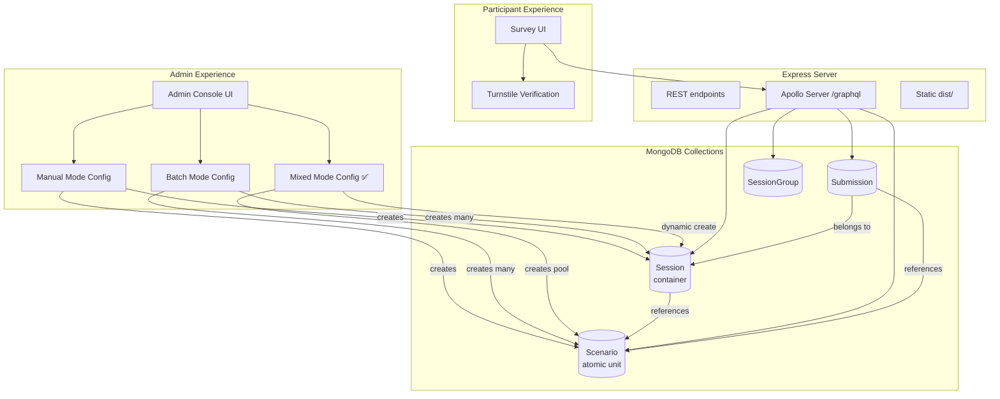

# System Design

This document describes how the PD Human-Agent Data Collect Demo is built using a **scenario-centric architecture**. Every section traces back to the requirements in [`requirements.md`](requirements.md).

**Implementation Status**: 🟢 **Phase 12-16 Complete** | 🟡 **Phase 17 Partial** (Heatmap deferred)

---

## Overview

A two-tier web application with a fundamentally refactored data model:

- **Frontend** — React 19 SPA built with Vite, routed by `react-router-dom@7`, styled by TailwindCSS (loaded from CDN) plus Material UI components. Communicates with backend exclusively over GraphQL with REST escape hatches for admin login and Turnstile.
- **Backend** — Node 20 Express 5 server hosting Apollo Server 5 (GraphQL), persisting through Mongoose to MongoDB.
- **Bot protection** — Cloudflare Turnstile with server-side `httpOnly` cookie.

**Architecture Innovation**: 
The system uses a **scenario-centric data model** where `Scenario` is the atomic unit and `Session` is a lightweight container. This unified design eliminates mode-specific code branches and enables flexible data collection strategies including Manual, Batch, and Mixed modes.

---

## Implementation Status Summary

| Phase | Status | Completion Date | Notes |
|-------|--------|-----------------|-------|
| Phase 1-11 | ✅ Complete | 2026-04-28 | Baseline features |
| Phase 12 | ✅ Complete | 2026-04-28 | Data models (Scenario, Session, etc.) |
| Phase 13 | ✅ Complete | 2026-04-28 | GraphQL API refactor |
| Phase 14 | ✅ Complete | 2026-04-28 | Utils layer |
| Phase 15 | ✅ Complete | 2026-04-29 | Admin UI (Manual, Batch, Mixed) |
| Phase 16 | ✅ Complete | 2026-04-29 | Survey flow (all modes) |
| Phase 17 | 🟡 Partial | Ongoing | Testing complete, heatmap deferred |

**Recent Updates**:
- 2026-04-29: Legacy API completely removed (~500 lines)
- 2026-04-29: Mixed Mode core functionality implemented
- 2026-05-04: NetworkGraph undefined bug fixed
- 2026-05-04: SurveyOutro completeSurvey bug fixed

---

## Architecture Diagram



---

## Core Architectural Principle: Scenario-Centric Design

### The Unified Abstraction

```
Scenario (atomic) → self-contained experiment condition
    ↓
Session (container) → participant experience (ordered list of scenario IDs)
    ↓
Submission → responses to a session's scenarios
```

**Key Insight**: 
> All three launch modes (Manual, Batch, Mixed) are identical from the participant's perspective: they complete a Session. The difference is **how** that Session's scenarios are selected and composed, not **what** happens during completion.

### Three Modes, One Model

| Mode | Session Composition | Scenario Selection Logic | URLs Generated |
|------|---------------------|--------------------------|----------------|
| **Manual** | Admin manually selects edges → generates design matrix → creates scenarios → creates one session | Scenarios come from a single edge configuration | `/survey/welcome?sessionId=<uuid>` |
| **Batch** | For each of C(12,k) edge combinations → generate design matrix → create scenarios → create one session per combination | Scenarios grouped by edge combination, one session per group | `/survey/welcome?sessionId=<uuid>` (multiple URLs) |
| **Mixed** | Generate scenarios for all combinations k=1..maxK → pool all scenarios → dynamically select S scenarios per participant → create personalized session | Balanced selection from scenario pool (prioritize low `responseCount`) | `/survey/welcome?groupId=<uuid>&mode=mixed` (one URL, dynamic sessions) |

**No `launchMode` field needed** — the mode is implicit in the data structure.

---

## Data Models

**Implementation Status**: ✅ **COMPLETED 2026-04-28** - All models implemented and tested

UUIDs are used as primary keys (`_id: { type: String, default: () => randomUUID() }`) for `Scenario`, `Session`, and `SessionGroup`. `Submission` uses Mongoose default ObjectId.

### `Scenario` (New Model - Atomic Unit) ✅

```javascript
// backend/models/Scenario.js
{
  _id: String (UUID),                    // Primary key
  
  // Experiment configuration (self-contained)
  focalNode: String,                     // 'A1' | 'A2' | 'B3' | 'B4'
  opponentNode: String,
  activeEdgeIds: [String],               // e.g., ['A1-A2', 'A2-B3']
  
  // Specific state (this scenario's condition)
  edgeStates: Map<String, String>,       // edgeId → 'low' | 'high'
  scenarioIndex: Number,                 // Position in original design matrix (optional)
  
  // Ownership (traceability)
  groupId: String | null,                // Which SessionGroup created this
  setupId: String | null,                // Original SessionSetup ID (for migration/reference)
  
  // Data collection tracking (scenario-level!)
  targetSize: Number,                    // How many responses needed for THIS scenario
  responseCount: Number,                 // How many responses collected so far
  
  status: 'active' | 'completed' | 'paused',
  
  createdAt: Date,
  updatedAt: Date
}
```

**Indexes**:
- `{ groupId: 1, status: 1, responseCount: 1 }` — Mixed Mode balanced selection
- `{ setupId: 1, scenarioIndex: 1 }` — Traceability

**Maps to**: REQ-321 (Scenario as Atomic Unit)

### `Session` (Refactored - Lightweight Container) ✅

```javascript
// backend/models/Session.js (renamed from SessionSetup)
{
  _id: String (UUID),                    // Primary key
  
  // Container: references scenarios (NOT embedding!)
  scenarioIds: [String],                 // Array of Scenario._id, preserves order
  
  // Session-level metadata
  focalNode: String,                     // For display/filtering
  opponentNode: String,
  sampleSize: Number,                    // How many PEOPLE should complete this session
  
  // Ownership
  groupId: String | null,                // Which SessionGroup owns this
  
  // Cached stats
  submissionCount: Number,               // How many people completed this session
  
  // Mixed Mode metadata
  metadata: {
    participantId: String | null,        // For Mixed Mode: which participant is this for?
    createdFor: 'manual' | 'batch' | 'mixed' | null
  },
  
  createdAt: Date,
  updatedAt: Date
}
```

**Virtual field**:
```javascript
SessionSchema.virtual('scenarios', {
  ref: 'Scenario',
  localField: 'scenarioIds',
  foreignField: '_id'
});
```

**Indexes**:
- `{ groupId: 1 }`
- `{ metadata.participantId: 1 }` — Mixed Mode participant lookup

**Maps to**: REQ-322 (Session as Scenario Container)

### `Submission` (Updated - References Scenarios by ID) ✅

```javascript
// backend/models/Submission.js
{
  _id: ObjectId,                         // Mongoose default
  
  sessionId: String,                     // References Session._id
  participantId: String | null,          // Mixed Mode: uniqueness check
  
  // Responses (now reference Scenario UUIDs)
  results: [{
    scenarioId: String,                  // References Scenario._id (was: Number index)
    cooperationProbability: Number,      // [0, 1]
    responseTime: Number,                // milliseconds
    answeredAt: Date
  }],
  
  demographics: {
    age: Number,
    gender: String,
    education: String
  } | null,
  
  isCompleted: Boolean,
  completedAt: Date | null,
  
  createdAt: Date,
  updatedAt: Date
}
```

**Indexes**:
- `{ sessionId: 1 }`
- `{ sessionId: 1, participantId: 1 }` — Prevent duplicate Mixed Mode submissions

**Maps to**: REQ-402 (Per-scenario response capture)

**Known Issue (Fixed 2026-05-04)**: SurveyOutro component was not calling `completeSurvey` mutation, causing `isCompleted` to always be `false`. Fixed by passing `onComplete` prop and calling it on final submission.

### `SessionGroup` (Simplified - Unified Config) ✅

```javascript
// backend/models/SessionGroup.js
{
  _id: String (UUID),
  
  name: String,
  description: String | null,
  
  // Unified configuration (mode implicit from which fields are set)
  config: {
    // Batch Mode fields
    edgeCount: Number | null,            // k value
    
    // Mixed Mode fields
    maxK: Number | null,                 // 1..12
    scenariosPerSession: Number | null,  // S
    targetSizePerScenario: Number | null,
    
    // Common fields
    focalNode: String,
    opponentNode: String,
    sampleSize: Number                   // Per-session target (Batch/Manual)
  },
  
  // Cached statistics
  totalSessions: Number,                 // Sessions created
  totalScenarios: Number,                // Scenarios created (Mixed Mode)
  
  status: 'creating' | 'active' | 'completed' | 'archived',
  
  createdAt: Date,
  updatedAt: Date
}
```

**Mode detection**:
```javascript
function getGroupMode(group) {
  if (group.config.maxK) return 'mixed';
  if (group.config.edgeCount) return 'batch';
  return 'manual';  // Or null for standalone sessions
}
```

**Indexes**:
- `{ status: 1 }`
- `{ createdAt: -1 }`

**Maps to**: REQ-301 (Batch), REQ-306 (Mixed)

---

## Three Modes Implementation

### Mode 1: Manual (Single Session) ✅ Implemented 2026-04-29

**Admin Action**: Configure focal, opponent, edges, sampleSize

**Backend Logic** ([`createManualSession`](../backend/graphql/resolvers.js)):
```javascript
async function createManualSession(input) {
  // 1. Generate design matrix
  const designMatrix = generateDesignMatrix(input.activeEdgeIds);
  
  // 2. Create independent Scenario documents
  const scenarios = await Scenario.insertMany(
    designMatrix.map((edgeStates, index) => ({
      focalNode: input.focalNode,
      opponentNode: input.opponentNode,
      activeEdgeIds: input.activeEdgeIds,
      edgeStates,
      scenarioIndex: index,
      groupId: null,
      targetSize: 0,  // Manual mode doesn't track scenario-level
      responseCount: 0,
      status: 'active'
    }))
  );
  
  // 3. Create Session referencing scenarios
  const session = await Session.create({
    scenarioIds: scenarios.map(s => s._id),
    focalNode: input.focalNode,
    opponentNode: input.opponentNode,
    sampleSize: input.sampleSize,
    groupId: null,
    metadata: { createdFor: 'manual' }
  });
  
  return session;
}
```

**Participant URL**: `/survey/welcome?sessionId=<session._id>`

**Maps to**: REQ-201, REQ-202

### Mode 2: Batch (Multiple Sessions, Factorial Sweep) ✅ Implemented 2026-04-29

**Admin Action**: Configure name, k, focal, opponent, sampleSize

**Backend Logic** ([`createBatchSessions`](../backend/graphql/resolvers.js)):
```javascript
async function createBatchSessions(input) {
  // 1. Create SessionGroup
  const group = await SessionGroup.create({
    name: input.name,
    config: {
      edgeCount: input.edgeCount,
      focalNode: input.focalNode,
      opponentNode: input.opponentNode,
      sampleSize: input.sampleSize
    },
    status: 'creating'
  });
  
  // 2. Generate all C(12, k) combinations
  const combinations = generateCombinations(ALL_EDGES, input.edgeCount);
  
  // 3. For each combination, create scenarios + session
  for (const combo of combinations) {
    const designMatrix = generateDesignMatrix(combo);
    
    // Create scenarios for this combination
    const scenarios = await Scenario.insertMany(
      designMatrix.map((edgeStates, index) => ({
        focalNode: input.focalNode,
        opponentNode: input.opponentNode,
        activeEdgeIds: combo,
        edgeStates,
        scenarioIndex: index,
        groupId: group._id,
        targetSize: 0,  // Batch mode tracks session-level, not scenario-level
        responseCount: 0,
        status: 'active'
      }))
    );
    
    // Create session for this combination
    await Session.create({
      scenarioIds: scenarios.map(s => s._id),
      focalNode: input.focalNode,
      opponentNode: input.opponentNode,
      sampleSize: input.sampleSize,
      groupId: group._id,
      metadata: { createdFor: 'batch' }
    });
  }
  
  // 4. Activate group
  group.totalSessions = combinations.length;
  group.status = 'active';
  await group.save();
  
  return { groupId: group._id, totalSessions: combinations.length };
}
```

**Participant URLs**: `/survey/welcome?sessionId=<session._id>` (many URLs, one per combination)

**Verified**: k=2 generates 66 sessions with 264 scenarios (66×4).

**Maps to**: REQ-301

### Mode 3: Mixed (Dynamic Session per Participant) ✅ Implemented 2026-04-29

**Admin Action**: Configure name, maxK, scenariosPerSession (S), targetSizePerScenario, focal, opponent

**Backend Logic** ([`createMixedGroup`](../backend/graphql/resolvers.js)):
```javascript
async function createMixedGroup(input) {
  // 1. Create SessionGroup
  const group = await SessionGroup.create({
    name: input.name,
    config: {
      maxK: input.maxK,
      scenariosPerSession: input.scenariosPerSession,
      targetSizePerScenario: input.targetSizePerScenario,
      focalNode: input.focalNode,
      opponentNode: input.opponentNode
    },
    status: 'creating'
  });
  
  // 2. Generate scenario pool (all k=1..maxK combinations)
  const scenarioPool = [];
  
  for (let k = 1; k <= input.maxK; k++) {
    const combinations = generateCombinations(ALL_EDGES, k);
    
    for (const combo of combinations) {
      const designMatrix = generateDesignMatrix(combo);
      
      for (const [index, edgeStates] of designMatrix.entries()) {
        scenarioPool.push({
          focalNode: input.focalNode,
          opponentNode: input.opponentNode,
          activeEdgeIds: combo,
          edgeStates,
          scenarioIndex: index,
          groupId: group._id,
          targetSize: input.targetSizePerScenario,  // KEY: scenario-level tracking
          responseCount: 0,
          status: 'active'
        });
      }
    }
  }
  
  // 3. Bulk create scenarios
  await Scenario.insertMany(scenarioPool);
  
  // 4. Activate group
  group.totalScenarios = scenarioPool.length;
  group.status = 'active';
  await group.save();
  
  return { 
    groupId: group._id, 
    totalScenarios: scenarioPool.length,
    estimatedSessions: Math.ceil(
      (scenarioPool.length * input.targetSizePerScenario) / input.scenariosPerSession
    )
  };
}
```

**Participant URL**: `/survey/welcome?groupId=<group._id>&mode=mixed` (single URL, sessions created dynamically)

**Verified**: maxK=2 generates 288 scenarios (12×2 + 66×4).

**Participant Flow** ([`startMixedSession`](../backend/graphql/resolvers.js)):
```javascript
async function startMixedSession(groupId, participantId) {
  const group = await SessionGroup.findById(groupId);
  const S = group.config.scenariosPerSession;
  
  // Check if participant already has a session (resume)
  let session = await Session.findOne({
    groupId,
    'metadata.participantId': participantId
  });
  
  if (!session) {
    // **Balanced Selection Strategy** (REQ-307)
    // Select scenarios with lowest responseCount, then random sample
    const candidates = await Scenario
      .find({ groupId, status: 'active' })
      .sort({ responseCount: 1 })  // Prioritize under-sampled
      .limit(S * 2);  // Get 2× candidates for randomization
    
    // Random sample from bottom 2S
    const selected = _.sampleSize(candidates, S);
    
    // Create personalized session
    session = await Session.create({
      scenarioIds: selected.map(s => s._id),
      focalNode: group.config.focalNode,
      opponentNode: group.config.opponentNode,
      sampleSize: 1,  // Mixed mode: each session for one person
      groupId,
      metadata: {
        participantId,
        createdFor: 'mixed'
      }
    });
  }
  
  return session;
}
```

**Maps to**: REQ-306, REQ-307

---

## Unified Survey Flow (All Modes) ✅ Implemented 2026-04-29

**Critical Design Win**: The survey completion logic is **identical** for all three modes.

### Start Survey ✅

```javascript
// Unified: works for Manual, Batch, AND Mixed
async function startSurvey(sessionId) {
  // Turnstile check (REQ-102)
  if (!context.isTurnstileVerified) {
    throw new Error('Turnstile verification required');
  }
  
  // Session full check
  const session = await Session.findById(sessionId);
  if (session.submissionCount >= session.sampleSize) {
    throw new Error('Session full');
  }
  
  // Create submission
  const submission = await Submission.create({
    sessionId,
    results: [],
    isCompleted: false
  });
  
  return submission;
}
```

**Maps to**: REQ-401

### Save Scenario Answer ✅

```javascript
// Unified: scenarioId is now a UUID reference
async function saveSurveyAnswer(submissionId, scenarioId, probability) {
  // Validate
  if (probability < 0 || probability > 1) {
    throw new Error('cooperationProbability must be between 0 and 1');
  }
  
  // Update submission
  const submission = await Submission.findById(submissionId);
  const existingIndex = submission.results.findIndex(r => r.scenarioId === scenarioId);
  
  if (existingIndex >= 0) {
    submission.results[existingIndex].cooperationProbability = probability;
    submission.results[existingIndex].answeredAt = new Date();
  } else {
    submission.results.push({
      scenarioId,
      cooperationProbability: probability,
      answeredAt: new Date()
    });
  }
  
  await submission.save();
  
  // ** KEY: Update scenario's responseCount (REQ-308) **
  // Only increment on first answer (not on updates)
  if (existingIndex < 0) {
    await Scenario.findByIdAndUpdate(scenarioId, { $inc: { responseCount: 1 } });
  }
  
  return submission;
}
```

**Maps to**: REQ-402, REQ-308

### Complete Survey ✅

```javascript
// Unified: works for all modes
async function completeSurvey(submissionId, demographics) {
  const submission = await Submission.findByIdAndUpdate(
    submissionId,
    {
      demographics,
      isCompleted: true,
      completedAt: new Date()
    },
    { new: true }
  );
  
  // Increment session's submissionCount
  const session = await Session.findById(submission.sessionId);
  session.submissionCount += 1;
  await session.save();
  
  // ** Mixed Mode: Check group completion (REQ-309) **
  if (session.groupId && session.metadata?.createdFor === 'mixed') {
    const group = await SessionGroup.findById(session.groupId);
    const targetSize = group.config.targetSizePerScenario;
    
    // Count incomplete scenarios
    const incompleteCount = await Scenario.countDocuments({
      groupId: session.groupId,
      responseCount: { $lt: targetSize }
    });
    
    // If all scenarios complete, mark group as completed
    if (incompleteCount === 0) {
      group.status = 'completed';
      await group.save();
    }
  }
  
  return submission;
}
```

**Maps to**: REQ-403, REQ-309

---

## Frontend Architecture

### Admin UI

#### Unified Mode Selection ([`SetupPanel.tsx`](../components/SetupPanel.tsx)) ✅
```typescript
<Tabs>
  <Tab label="Manual Mode">
    // Single session configuration
  </Tab>
  <Tab label="Batch Mode">
    // Batch group configuration
  </Tab>
  <Tab label="Mixed Mode">
    <MixedModeConfig />  {/* NEW ✅ */}
  </Tab>
</Tabs>
```

#### Mixed Mode Configuration ([`MixedModeConfig.tsx`](../components/MixedModeConfig.tsx)) ✅
```typescript
function MixedModeConfig() {
  const [maxK, setMaxK] = useState(2);
  const [scenariosPerSession, setScenariosPerSession] = useState(10);
  const [targetSize, setTargetSize] = useState(5);
  
  // Calculate estimates
  const totalScenarios = useMemo(() => {
    let sum = 0;
    for (let k = 1; k <= maxK; k++) {
      sum += binomial(12, k) * Math.pow(2, k);
    }
    return sum;
  }, [maxK]);
  
  const estimatedParticipants = Math.ceil(
    (totalScenarios * targetSize) / scenariosPerSession
  );
  
  return (
    <form onSubmit={handleSubmit}>
      <Slider label="Max K" value={maxK} onChange={setMaxK} min={1} max={4} />
      <Slider label="Scenarios per Session" value={scenariosPerSession} min={5} max={30} step={5} />
      <NumberInput label="Target Size per Scenario" value={targetSize} onChange={setTargetSize} />
      
      <Alert severity="info">
        Will generate {totalScenarios} scenarios.
        Estimated {estimatedParticipants} participants needed.
      </Alert>
      
      <Button type="submit">Create Mixed Group</Button>
    </form>
  );
}
```

### Survey Flow (Minimal Changes) ✅

```typescript
// App.tsx (UPDATED routing logic)
function App() {
  const searchParams = new URLSearchParams(location.search);
  const sessionId = searchParams.get('sessionId');
  const groupId = searchParams.get('groupId');
  const mode = searchParams.get('mode');
  
  // Resolve actual sessionId
  useEffect(() => {
    if (sessionId) {
      setResolvedSessionId(sessionId);
    } else if (groupId && mode === 'mixed') {
      // Mixed mode: create or retrieve session
      startMixedSession({
        variables: { groupId, participantId: getParticipantId() }
      }).then(({ data }) => {
        const newSessionId = data.startMixedSession.sessionId;
        navigate(`/survey/welcome?sessionId=${newSessionId}`, { replace: true });
      });
    }
  }, [sessionId, groupId, mode]);
  
  return (
    <Routes>
      <Route path="/survey/*" element={<SurveyView sessionId={resolvedSessionId} />} />
      ...
    </Routes>
  );
}

// SurveyView.tsx (NO CHANGES NEEDED!)
function SurveyView({ sessionId }) {
  const { data: session } = useSession(sessionId);  // Auto-populates scenarios
  const [currentIndex, setCurrentIndex] = useState(0);
  
  // Works for ALL modes because session.scenarios is always an array
  const scenario = session.scenarios[currentIndex];
  
  return (
    <div>
      <Progress current={currentIndex + 1} total={session.scenarios.length} />
      <ScenarioView scenario={scenario} onAnswer={handleAnswer} />
    </div>
  );
}
```

**Key Insight**: `SurveyView` doesn't need to know which mode created the session!

---

## Known Issues and Fixes

### Fixed Issues

| ID | Component | Issue | Fix Date | Status |
|----|-----------|-------|----------|--------|
| BUG-001 | [`NetworkGraph.tsx`](../components/NetworkGraph.tsx) | TypeError: Cannot read properties of undefined (reading 'includes') | 2026-05-04 | ✅ Fixed |
| BUG-002 | [`SurveyOutro.tsx`](../components/SurveyOutro.tsx) | completeSurvey mutation never called, all submissions incomplete | 2026-05-04 | ✅ Fixed |

#### BUG-001: NetworkGraph undefined error
**Problem**: `activeEdges` could be undefined in multiple locations, causing crashes when calling `.includes()`.

**Solution**: Added defensive checks at 5 locations:
```typescript
// Before (crash-prone)
const activeEdges = mode === 'survey' && scenario?.activeEdgeIds 
  ? scenario.activeEdgeIds 
  : setup.activeEdgeIds;

// After (safe)
const activeEdges = (mode === 'survey' && scenario?.activeEdgeIds) 
  || setup?.activeEdgeIds 
  || [];
```

#### BUG-002: Incomplete submissions bug
**Problem**: [`SurveyOutro.tsx`](../components/SurveyOutro.tsx) never called `completeSurvey` mutation, so all submissions had `isCompleted: false`.

**Solution**: 
1. Updated `SurveyOutro` to accept `onComplete` and `entryId` props
2. Added `handleFinalSubmit` function that calls `completeSurvey`
3. Updated `SurveyView` to pass these props
4. Created repair script [`scripts/fix-incomplete-submission.mjs`](../scripts/fix-incomplete-submission.mjs) for historical data

---

## Technology Stack

| Layer | Choice | Rationale |
|-------|--------|-----------|
| Build | Vite 6 | Fast dev server, ESM-first |
| UI | React 19 + TailwindCSS + MUI | React for familiarity; Tailwind via CDN; MUI for complex inputs |
| Routing | react-router-dom@7 | Standard SPA routing |
| Notifications | react-hot-toast | Lightweight feedback |
| GraphQL server | @apollo/server@5 + express5 integration | Mature, well-documented |
| HTTP server | Express 5 | Adequate for small REST surface |
| DB | MongoDB + Mongoose 8 | Document model fits scenarios array; Mongoose handles UUIDs |
| Bot defense | Cloudflare Turnstile | Free, privacy-friendly |
| Visualization | D3 v7 | Network graphs |
| Tests | Vitest + Testing Library | Co-located with Vite |

---

## Performance Considerations

- **Scenario populate**: Session.scenarios uses virtual populate. For sessions with 100+ scenarios, consider pagination or selective loading.
- **Balanced selection**: Mixed Mode queries sort by `responseCount` — index on `{ groupId: 1, status: 1, responseCount: 1 }` is critical.
- **Atomic updates**: `$inc` on `Scenario.responseCount` handles concurrency safely.
- **Batch inserts**: `Scenario.insertMany` for Mixed Mode scenario pools (potentially thousands of documents) — tested at scale (288 scenarios).

---

## Security Considerations

- Admin password env-only
- Turnstile cookie `httpOnly`, `sameSite=lax`, `secure` in prod
- `clearDatabase` hard-blocked in production
- No CSRF tokens (relies on same-site cookies + JSON content type)

**Mixed Mode consideration**: 
- Participant ID uniqueness relies on localStorage — consider adding cookie fingerprinting or requiring email registration to prevent repeat submissions.

---

## Summary of Key Changes from Legacy Design

| Aspect | Old Design | New Design (Scenario-Centric) |
|--------|-----------|-------------------------------|
| **Atomic unit** | SessionSetup (embedded scenarios) | **Scenario** (independent documents) |
| **Session model** | SessionSetup with embedded data | **Session** with scenario ID references |
| **Mode handling** | Implicit, no explicit Mixed Mode support | **Three modes unified**, Mixed Mode fully supported |
| **Data collection** | Session-level only | **Scenario-level tracking** in Mixed Mode |
| **Submission.results** | `scenarioId: Number` (index) | `scenarioId: String` (UUID reference) |
| **SessionGroup** | `batchMode` boolean + separate fields | **Unified `config` object**, mode implicit |
| **Admin UI** | Manual + Batch | **Manual + Batch + Mixed** ✅ |
| **Survey flow** | Mode-agnostic (by accident) | Mode-agnostic (**by design**, REQ-323) |
| **GraphQL** | SessionSetup type + legacy queries | **`Session` + `Scenario`** types, clean API |
| **URL format** | `?setupId=` | `?sessionId=` or `?groupId=&mode=mixed` |
| **Code complexity** | ~500 lines legacy code | Removed, unified architecture |

---

## Traceability Matrix

| REQ | Design Components | Status |
|-----|-------------------|--------|
| REQ-201..203 | Manual Mode: `createManualSession` resolver, UI | ✅ Complete |
| REQ-301..304 | Batch Mode: `createBatchSessions` resolver, UI | ✅ Complete |
| REQ-306..309 | Mixed Mode: `createMixedGroup`, `startMixedSession` resolvers, `MixedModeConfig` | ✅ Complete |
| REQ-310 | Scenario heatmap visualization | ⏸️ Deferred |
| REQ-321 | `Scenario` model with independent collection | ✅ Complete |
| REQ-322 | `Session` model with `scenarioIds` reference array | ✅ Complete |
| REQ-323 | Unified `startSurvey`, `saveSurveyAnswer`, `completeSurvey` | ✅ Complete |
| REQ-401..405 | Survey flow: routing, response capture, completion | ✅ Complete |
| REQ-308 | `saveSurveyAnswer` atomically increments `Scenario.responseCount` | ✅ Complete |
| REQ-309 | `completeSurvey` checks scenario-level completion | ✅ Complete |

---

## Next Steps

### Completed ✅
- Phase 12-14: Backend refactor (data models, GraphQL API, utils)
- Phase 15-16: Frontend refactor (Admin UI, Survey flow)
- Legacy API removal
- Mixed Mode core implementation
- Bug fixes (NetworkGraph, SurveyOutro)

### Remaining 🟡
- **REQ-310**: Scenario completion heatmap for Mixed Mode groups
- Frontend test updates for new API
- Performance optimization if needed at scale

### Future Enhancements 💡
- CSV export of submissions
- Real-time admin dashboards
- Enhanced participant uniqueness enforcement
- Multi-language support (i18n expansion)
